LEGIONARY ASPIRING CHAMPION

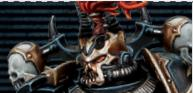

| APL | Move | Save | Wounds |
|-----|------|------|--------|
| 3   | 6"   | 3+   | 15     |

<table><tr><td></td><td>NAME</td><td>ATK</td><td>HIT</td><td>DMG</td><td>WR</td></tr><tr><td></td><td>Plasma pistol (standard)</td><td>4</td><td>3+</td><td>3/5</td><td>Range 8&quot;, Piercing 1</td></tr><tr><td></td><td>Plasma pistol (supercharge)</td><td>4</td><td>3+</td><td>4/5</td><td>Range 8&quot;, Hot, Lethal 5+, Piercing 1</td></tr><tr><td></td><td>Tainted bolt pistol</td><td>4</td><td>3+</td><td>3/5</td><td>Range 8&quot;, Rending</td></tr><tr><td></td><td>Power fist</td><td>5</td><td>4+</td><td>5/7</td><td>Brutal</td></tr><tr><td></td><td>Power maul</td><td>5</td><td>3+</td><td>4/6</td><td>Shock</td></tr><tr><td></td><td>Power weapon</td><td>5</td><td>3+</td><td>4/6</td><td>Lethal 5+</td></tr><tr><td></td><td>Tainted chainsword</td><td>5</td><td>3+</td><td>4/5</td><td>Rending</td></tr></table>

In the Eyes of the Gods: Once during each of this operative's activations, if it incapacitates an enemy operative, add 1 to its APL stat until the end of that activation. 

## LEGIONARY®, CHAOS, HERETIC ASTARTES, LEADER, ASPIRING CHAMPION

32 

LEGIONARY CHOSEN

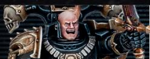

| APL | Move | Save | Wounds |
|-----|------|------|--------|
| 3   | 6"   | 3+   | 15     |

<table><tr><td>NAME</td><td>ATK</td><td>HIT</td><td>DMG</td><td>WR</td></tr><tr><td>Plasma pistol (standard)</td><td>4</td><td>3+</td><td>3/5</td><td>Range 8“, Piercing 1</td></tr><tr><td>Plasma pistol (supercharge)</td><td>4</td><td>3+</td><td>4/5</td><td>Range 8“, Hot, Lethal 5+, Piercing 1</td></tr><tr><td>Tainted bolt pistol</td><td>4</td><td>3+</td><td>3/5</td><td>Range 8“, Rending</td></tr><tr><td>Daemon blade</td><td>5</td><td>3+</td><td>4/7</td><td>Lethal 5+</td></tr></table>

Daemonic Aura: Whenever an enemy operative performs the Fall Back action while within control range of this operative, you can use this rule. If you do, roll one D6: on a 3+, that enemy operative cannot perform that action during that activation/counteraction (the AP spent on it is refunded). 

Soul Gorge: After this operative fights or retaliates, if it isn't incapacitated, but it incapacitated an enemy operative during that sequence, it regains up to D3+1 lost wounds. 

## LEGIONARY®, CHAOS, HERETIC ASTARTES, LEADER, CHOSEN

32 

LEGIONARY ANOINTED

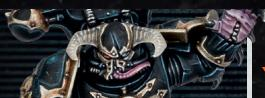

| APL | Move | Save | Wounds |
|-----|------|------|--------|
| 3   | 6"   | 3+   | 14     |

<table><tr><td>NAME</td><td>ATK</td><td>HIT</td><td>DMG</td><td>WR</td></tr><tr><td>Bolt pistol</td><td>4</td><td>3+</td><td>3/4</td><td>Range 8&quot;</td></tr><tr><td>Daemonic claw</td><td>5</td><td>3+</td><td>4/5</td><td>Rending</td></tr></table>

Unleash Daemon: Once per battle, when this operative is activated, you can use this rule. If you do, until the end of the battle: 

- This operative cannot perform the Pick Up Marker or mission actions (excluding Operate Hatch). If it's carrying a marker, it must immediately perform the Place Marker action for OAP (this takes precedence over all other rules). 

- Normal and Critical Dmg of 4 or more inflicts 1 less damage on this operative. If this operative has the NURGLE keyword, you cannot reduce the damage of an attack dice by more than 1. In other words, you cannot use both rules to reduce Normal Dmg of 4 or more by 2. 

- Its daemonic claw has the Ceaseless and Lethal 5+ weapon rules. 

## LEGIONARY, CHAOS, HERETIC ASTARTES, ANOINTED

32 

LEGIONARY BALEFIRE ACOLYTE

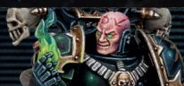

| APL | Move | Save | Wounds |
|-----|------|------|--------|
| 3   | 6"   | 3+   | 14     |

<table><tr><td></td><td>NAME</td><td>ATK</td><td>HIT</td><td>DMG</td><td>WR</td></tr><tr><td></td><td>Bolt pistol</td><td>4</td><td>3+</td><td>3/4</td><td>Range 8&quot;</td></tr><tr><td></td><td>Fireblast</td><td>4</td><td>3+</td><td>3/4</td><td>PSYCHIC, Blast 2&quot;, 1&quot; Devastating 1, Saturate</td></tr><tr><td></td><td>Life siphon</td><td>5</td><td>3+</td><td>3/3</td><td>PSYCHIC, Saturate, Siphon Life*</td></tr><tr><td></td><td>Fell dagger</td><td>5</td><td>3+</td><td>3/4</td><td>PSYCHIC, Rending, Siphon Life*</td></tr></table>

*Siphon Life: When you select this weapon, you can use this rule. If you do, at the start of the Resolve Attack Dice step, select one friendly LEGIONARY operative visible to and within 6" of this operative. For each attack dice you resolve during that step that inflicts damage, that friendly operative regains 1 lost wound, or D3 lost wounds if it was a critical success. You cannot use this weapon rule more than once per turning point. 

32 

## LEGIONARY BUTCHER

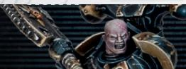

| APL | Move | Save | Wounds |
|-----|------|------|--------|
| 3   | 6"   | 3+   | 14     |

<table><tr><td>NAME</td><td>ATK</td><td>HIT</td><td>DMG</td><td>WR</td></tr><tr><td>Bolt pistol</td><td>4</td><td>3+</td><td>3/4</td><td>Range 8&quot;</td></tr><tr><td>Double-handed chainaxe</td><td>5</td><td>4+</td><td>5/7</td><td>Brutal</td></tr></table>

## Devastating Onslaught:

- Whenever this operative is fighting or retaliating, enemy operatives cannot assist. 

- At the end of each enemy operative's activation or counteraction, you can select one enemy operative within 2" of this operative. This operative can perform a free Charge action (you can change its order to Engage to do so), but it cannot move more than 2" and must end that move within control range of that selected operative. 

LEGIONARY, CHAOS, HERETIC ASTARTES, BUTCHER 

32 

## LEGIONARY GUNNER

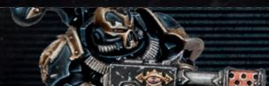

| APL | Move | Save | Wounds |
|-----|------|------|--------|
| 3   | 6"   | 3+   | 14     |

<table><tr><td></td><td>NAME</td><td>ATK</td><td>HIT</td><td>DMG</td><td>WR</td></tr><tr><td></td><td>Bolt pistol</td><td>4</td><td>3+</td><td>3/4</td><td>Range 8&quot;</td></tr><tr><td></td><td>Flamer</td><td>4</td><td>2+</td><td>3/3</td><td>Range 8&quot;, Saturate, Torrent 2&quot;</td></tr><tr><td></td><td>Meltagun</td><td>4</td><td>3+</td><td>6/3</td><td>Range 6&quot;, Devastating 4, Piercing 2</td></tr><tr><td></td><td>Plasma gun (standard)</td><td>4</td><td>3+</td><td>4/6</td><td>Piercing 1</td></tr><tr><td></td><td>Plasma gun (supercharge)</td><td>4</td><td>3+</td><td>5/6</td><td>Hot, Lethal 5+, Piercing 1</td></tr><tr><td></td><td>Fists</td><td>4</td><td>3+</td><td>3/4</td><td>-</td></tr></table>

LEGIONARY, CHAOS, HERETIC ASTARTES, GUNNER 

32 

## LEGIONARY HEAVY GUNNER

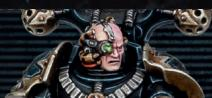

| APL | Move | Save | Wounds |
|-----|------|------|--------|
| 3   | 6"   | 3+   | 14     |

<table><tr><td></td><td>NAME</td><td>ATK</td><td>HIT</td><td>DMG</td><td>WR</td></tr><tr><td></td><td>Bolt pistol</td><td>4</td><td>3+</td><td>3/4</td><td>Range 8&quot;</td></tr><tr><td></td><td>Heavy bolter (focused)</td><td>5</td><td>3+</td><td>4/5</td><td>Heavy (Reposition only), Piercing Crits 1</td></tr><tr><td></td><td>Heavy bolter (sweeping)</td><td>4</td><td>3+</td><td>4/5</td><td>Heavy (Reposition only), Piercing Crits 1, Torrent 1&quot;</td></tr><tr><td></td><td>Missile launcher (frag)</td><td>4</td><td>3+</td><td>3/5</td><td>Blast 2&quot;, Heavy (Reposition only)</td></tr><tr><td></td><td>Missile launcher (krak)</td><td>4</td><td>3+</td><td>5/7</td><td>Heavy (Reposition only), Piercing 1</td></tr><tr><td></td><td>Reaper chaincannon (focused)</td><td>5</td><td>3+</td><td>3/4</td><td>Ceaseless, Heavy (Reposition only), Punishing</td></tr><tr><td></td><td>Reaper chaincannon (sweeping)</td><td>4</td><td>3+</td><td>3/4</td><td>Ceaseless, Heavy (Reposition only), Punishing, Torrent 2&quot;</td></tr><tr><td></td><td>Fists</td><td>4</td><td>3+</td><td>3/4</td><td>-</td></tr></table>

LEGIONARY®, CHAOS, HERETIC ASTARTES, HEAVY GUNNER 

32 

## LEGIONARY ICON BEARER

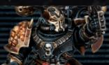

| APL | Move | Save | Wounds |
|-----|------|------|--------|
| 3   | 6"   | 3+   | 14     |

<table><tr><td>NAME</td><td>ATK</td><td>HIT</td><td>DMG</td><td>WR</td></tr><tr><td>Bolt pistol</td><td>4</td><td>3+</td><td>3/4</td><td>Range 8&quot;</td></tr><tr><td>Boltgun</td><td>4</td><td>3+</td><td>3/4</td><td>-</td></tr><tr><td>Chainsword</td><td>5</td><td>3+</td><td>4/5</td><td>-</td></tr><tr><td>Fists</td><td>4</td><td>3+</td><td>3/4</td><td>-</td></tr></table>

Icon Bearer: Whenever determining control of a marker, treat this operative's APL stat as 1 higher. Note this isn't a change to its APL stat, so any changes are cumulative with this. 

Favoured of the Dark Gods: In the Ready step of each Strategy phase, if this operative controls an objective marker that isn't tainted, that objective marker is tainted for the battle and you gain 1CP. Note that if any operative (including enemy operatives) has tainted an objective marker, you cannot taint that objective marker. 

32 

## LEGIONARY SHRIVETALON

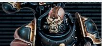

| APL | Move | Save | Wounds |
|-----|------|------|--------|
| 3   | 6"   | 3+   | 14     |

Vicious Reflexes: Whenever this operative is retaliating, you resolve the first attack dice (i.e. defender instead of attacker).

Horrifying Dismemberment: Whenever this operative incapacitates an enemy operative while fighting or retaliating, select one other enemy operative visible to and within 3" of either this operative or the incapacitated enemy operative. Subtract 1 from that enemy operative's APL stat until the end of its next activation. 

## RULES CONTINUE ON OTHER SIDE ▶

LEGIONARY®, CHAOS, HERETIC ASTARTES, SHRIVETALON 

32 

## LEGIONARY SHRIVETALON

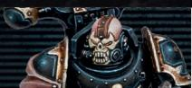

| APL | Move | Save | Wounds |
|-----|------|------|--------|
| 3   | 6"   | 3+   | 14     |

| NAME | ATK | HIT | DMG | WR |
|------|-----|-----|-----|-----|
| Bolt pistol | 4 | 3+ | 3/4 | Range 8", Rending |
| Flensing blades | 5 | 3+ | 3/5 | Lethal 5+ |

## GRISLY MARK

2AP 

Place your Grisly marker within this operative's control range. 

- Whenever an enemy operative is within 3" of your Grisly marker, your opponent must spend 1 additional AP for that enemy operative to perform the Pick Up Marker and mission actions. 

- Whenever determining control of a marker, treat the total APL stat of enemy operatives that contest it as 1 lower if at least one of those enemy operatives is within 3" of your Grisly marker. Note this isn't a change to the APL stat, so any changes are cumulative with this. 

This operative cannot perform this action more than once per battle, and cannot perform it while within control range of an enemy operative. 

## LEGIONARY WARRIOR

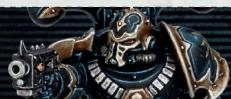

| APL | Move | Save | Wounds |
|-----|------|------|--------|
| 3   | 6"   | 3+   | 14     |

<table><tr><td></td><td>NAME</td><td>ATK</td><td>HIT</td><td>DMG</td><td>WR</td></tr><tr><td></td><td>Bolt pistol</td><td>4</td><td>3+</td><td>3/4</td><td>Range 8&quot;</td></tr><tr><td></td><td>Boltgun</td><td>4</td><td>3+</td><td>3/4</td><td>-</td></tr><tr><td></td><td>Chainsword</td><td>5</td><td>3+</td><td>4/5</td><td>-</td></tr><tr><td></td><td>Fists</td><td>4</td><td>3+</td><td>3/4</td><td>-</td></tr></table>

Infernal Pact: Once per battle, when a friendly LEGIONARY 

WARRIOR operative is activated, you can use this rule. If you do, change that operative's Marks of Chaos keyword. 

LEGIONARY, CHAOS, HERETIC ASTARTES, WARRIOR 

32 

## NOTES:

## LEGIONARIES KILL TEAM

ARCHETYPES: SECURITY, SEEK & DESTROY 

## OPERATIVES

1 LEGIONARY operative selected from the following list: 

• ASPIRING CHAMPION with one option from each of the following: 

- Plasma pistol or tainted bolt pistol 

Power fist, power maul, power weapon or tainted chainsword 

• CHOSEN with one of the following options: 

- Plasma pistol; daemon blade 

- Tainted bolt pistol; daemon blade 

5 LEGIONARY operators selected from the following list: 

• ANOINTED 

BALEFIRE ACOLYTE 

• BUTCHER 

CONTINUES ON OTHER SIDE 

• GUNNER with one of the following options: 

- Bolt pistol; flamer; fists 

- Bolt pistol; meltagun; fists 

- Bolt pistol; plasma gun; fists 

• HEAVY GUNNER with one of the following options: 

- Bolt pistol; heavy bolter; fists 

- Bolt pistol; missile launcher; fists 

- Bolt pistol; reaper chaincannon; fists 

• ICON BEARER with one of the following options: 

- Boltgun; fists 

- Bolt pistol; chainsword 

• SHRIVETALON 

• WARRIOR with one of the following options: 

- Boltgun; fists 

- Bolt pistol; chainsword 

Other than WARRIOR operatives, your kill team can only include each operative on this list once. 

## LEGIONARY FACTION RULE

## MARKS OF CHAOS

By making dark pacts with the Ruinous Powers, Legionaries may increase their own might. Yet such bargains rarely come without a cost. 

Whenever you select a LEGIONARY operative for the battle, you must select one of the following keywords for it to have for that battle: KHORNE, NURGLE, SLAANESH, TZEENTCH, UNDIVIDED. Each operative's keyword can be different, but a BALEFIRE ACOLYTE operative cannot have the KHORNE keyword. 

Friendly LEGIONARY operators have an additional rule determined by this keyword. In addition, LEGIONARY ploys have additional benefits for operatives with the relevant keyword. 

MARK OF CHAOS OPTIONS ARE PRESENTED ON THEIR OWN CARDS 

## LEGIONARY FACTION RULE

## MARKS OF CHAOS

## KHORNE

Wrathful Onslaught 

This operative's melee weapons have the Severe weapon rule. 

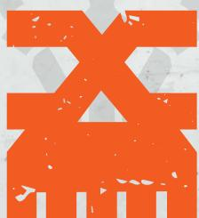

## LEGIONARY

## FACTION RULE

## MARKS OF CHAOS

## NURGLE

Disgusting Vigour 

Whenever Normal Dmg of 3 or more is inflicted on this operative, roll one D6: on a 5+, subtract 1 from that inflicted damage. 

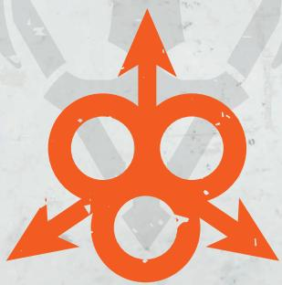

## LEGIONARY

## FACTION RULE

## MARKS OF CHAOS

## SLAANESH

Unnatural Agility 

Add 1" to this operative's Move stat. 

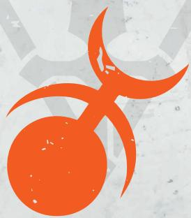

## LEGIONARY

## FACTION RULE

## MARKS OF CHAOS

## TZEENTCH

Empyreal Guidance 

This operative's ranged weapons have the Severe weapon rule. 

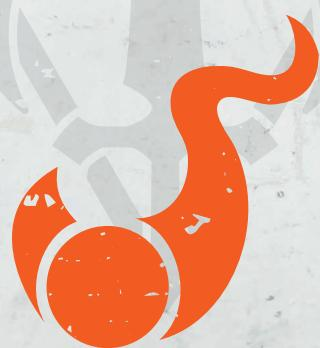

## LEGIONARY

## FACTION RULE

## MARKS OF CHAOS

## UNDIVIDED

Vicious Reavers 

Whenever this operative is shooting against, fighting against or retaliating against an enemy operative within 6" of it, this operative's weapons have the Ceaseless weapon rule. 

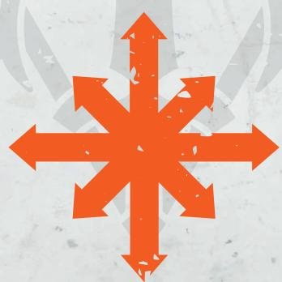

## LEGIONARY FACTION RULE

## ASTARTES

These genetically modified superhumans are made for one purpose: war. 

During each friendly LEGIONARY operative's activation, it can perform either two Shoot actions or two Fight actions. If it's two Shoot actions, a bolt pistol, boltgun or tainted bolt pistol must be selected for at least one of them. 

Each friendly LEGIONARY operative can counteract regardless of its order. 

## LEGIONARY

## MARKER/TOKEN GUIDE

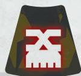

Mark of Chaos
Khorne token

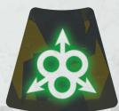

Mark of Chaos
Nurgle token

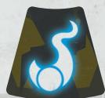

Mark of Chaos
Tzeentch token

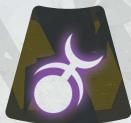

Mark of Chaos
Slaanesh token

Mark of Chaos
Undivided
token

Unleash
Daemon token

Tainted Rounds
token

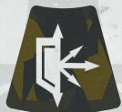

Warded
Armour token

Grisly marker

## LEGIONARY STRATEGY PLOY

## BLOOD FOR THE BLOOD GOD

Bloodthirsty, battle-hungry and filled with unbridled fury, Legionaries strike with rage-fuelled might. 

Whenever a friendly LEGIONARY operative (excluding KHORNE) is fighting, the first time you strike during that sequence, inflict 1 additional damage (to a maximum of 7). 

Add 1 to both Dmg stats of friendly LEGIONARY KHORNE operatives' melee weapons (to a maximum of 7). 

## LEGIONARY

## STRATEGY PLOY

## IMPLACABLE

Empowered by their transhuman might and the gifts of their daemonic patrons, Legionaries are monstrously resilient. 

Whenever an operative is shooting a friendly LEGIONARY operative, weapons with the Piercing 1 weapon rule have the Piercing Crits 1 weapon rule instead. 

You can ignore any changes to the stats of friendly LEGIONARY NURGLE operatives from being injured (including their weapons' stats). 

## LEGIONARY STRATEGY PLOY

## QUICKSILVER SPEED

Some amongst the Heretic Astartes are possessed of a fleetness of foot and inhuman agility with which they beguile and confound the foe. 

Whenever a friendly LEGIONARY operative that performed an action in which it moved during this turning point is fighting, worsen the Hit stat of the enemy operative's melee weapons by 1. 

Whenever an operative is shooting a friendly LEGIONARY SLAANESH operative more than 6" from it that performed an action in which it moved during this turning point, worsen the Hit stat of the enemy operative's weapons by 1. 

In all cases for this ploy, this isn't cumulative with being injured. 

## LEGIONARY STRATEGY PLOY

## FICKLE FATES

With superhuman reactions, a Heretic Astartes warrior can use even fractional glimpses of future events to devastating effect. 

Whenever a friendly LEGIONARY operative is shooting a ready enemy operative, that friendly operative's ranged weapons have the Balanced weapon rule. 

Whenever an operative is shooting a ready friendly LEGIONARY TZEENTCH operative, in the Roll Defence Dice step, if you retain any critical successes, you can retain one of your fails as a normal success instead of discarding it. 

## LEGIONARY FIREFIGHT PLOY

## UNENDING BLOODSHED

Even when on the verge of death, the devotees of Khorne spend their last vestiges of energy to kill in the Blood God's name. 

Use this firefight ploy when a friendly LEGIONARY KHORNE operative is incapacitated while fighting or retaliating. You can strike the enemy operative in that sequence with one of your unresolved successes before it's removed from the killzone. 

## LEGIONARY FIREFIGHT PLOY

## MUTABILITY AND CHANGE

Tzeentch bestows upon his most devoted followers all manner of bizarre mutations, some of which may even prove beneficial. 

Use this firefight ploy when a friendly LEGIONARY TZEENTCH operative is activated. Until the end of that operative's activation, add 1 to its APL stat, but it cannot perform the same action more than once during that activation. If it's a WARRIOR operative, that operative's Marks of Chaos keyword cannot be changed during this turning point (see Infernal Pact additional rule). 

## LEGIONARY

## FIREFIGHT PLOY

## LEGIONARY

## FIREFIGHT PLOY

## MALIGNANT AURA

Those who swear themselves to Nurgle may be granted his favour. Some are even able to project an miasmic aura of decay. 

Use this firefight ploy when a friendly LEGIONARY NURGLE operative is performing the Shoot action, when you select a valid target. Until the end of that action, whenever that friendly operative is shooting an enemy operative within 3" of it (i.e. including secondary targets, if any), that friendly operative's ranged weapons have the Piercing 1 weapon rule. 

## SICKENING CAPTIVATION

Slaanesh bestows upon the loyal the power to nauseate their foes, using dazzling speed, sickening perfumed auras and horrific sonic projections. 

Use this firefight ploy during a friendly 

LEGIONARY® SLAANESH operative's activation, before or after it performs an action. Select one enemy operative visible to and within 4" of that friendly operative. Until the end of that enemy operative's next activation, subtract 1 from its APL stat. 

## LEGIONARY

## FACTION EQUIPMENT

## LEGIONARY

## FACTION EQUIPMENT

## WARDED ARMOUR

Daubed with profane icons, emblazoned with infernal scripture and blessed by the Ruinous Powers, this power armour possesses unholy resilience. 

STRATEGIC GAMBIT. Select one friendly LEGIONARY operative. Until the Ready step of the next Strategy phase, change that operative's Save stat to 2+. 

## TAINTED ROUNDS

Subjected to fell rituals, these bolt rounds are infused with corruption. 

Once per turning point, when a friendly LEGIONARY operative is performing the Shoot action and you select a bolt pistol or boltgun, you can use this rule. If you do, until the end of that action, that weapon has the Rending weapon rule. 

## LEGIONARY FACTION EQUIPMENT

## CHAOS TALISMANS

Those who carry the talismans of the Ruinous Powers may be granted great gifts, though they invariably come at a price. 

STRATEGIC GAMBIT. Select one Marks of Chaos keyword. Once during each of their activations, when a friendly LEGIONARY operative that has that keyword is shooting, fighting or retaliating, if you roll two or more fails, you can inflict D3 damage on that friendly operative to discard one of them and retain the other as a normal success instead. Note that if it's the Shoot action and that damage incapacitates that friendly operative, the action doesn't end (continue the sequence with your successful attack dice). 

# LEGIONARY FACTION EQUIPMENT

## MALEFIC BLADES

Redolent with daemonic energies, this blade hungers for blood. 

Friendly LEGIONARY operators have the following melee weapon: 

<table><tr><td>NAME</td><td>ATK</td><td>HIT</td><td>DMG</td></tr><tr><td>Malefic blade</td><td>5</td><td>3+</td><td>3/4</td></tr></table>

## NOTES:

## NOTES:

Rules will be periodically updated to maintain fair balance and interact more smoothly with the game. Rules changes will be updated directly into online documents and then listed below. Any minor changes to standardise wording that don't have any practical impact on the rule will be updated directly into online documents but not be listed here. 

## ERRATA

## OCTOBER '25

This section collects amendments to the rules. Amended text for clarification and edits are shown in blue, while amended text for balance updates are shown in magenta. 

## FIREFIGHT PLOYS, MUTABILITY AND CHANGE

Second sentence changed to read: 

'Until the end of that operative's activation, add 1 to its APL stat, but it cannot perform the same action more than once during that activation.' 

## STRATEGY PLOYS, IMPLACABLE

'NURGLE' keyword moved to other paragraph, paragraphs reordered and first paragraph changed to read: 

'Whenever an operative is shooting a friendly LEGIONARY® operative, weapons with the Piercing 1 weapon rule have the Piercing Crits 1 weapon rule instead.' 

## STRATEGY PLOYS, BLOOD FOR THE BLOOD GOD

Relevant part of first paragraph changed to read: 

‘[...] inflict 1 additional damage (to a maximum of 7).’ 

Relevant part of second paragraph changed to read: 

'LEGIONARY KHORNE operatives' melee weapons (to a maximum of 7).' 

## STRATEGY PLOYS, QUICKSILVER SPEED

First two paragraphs changed to read: 

'Whenever a friendly LEGIONARY operative that performed an action in which it moved during this turning point is fighting or retaliating, worsen the Hit stat of the enemy operative's melee weapons by 1. 

Whenever an operative is shooting a friendly LEGIONARY 

SLAANESH operative more than 6" from it that performed an action in which it moved during this turning point, worsen the Hit stat of the enemy operative's weapons by 1.' 

## STRATEGY PLOYS, FICKLE FATES

First paragraph changed to read: 

'Whenever a friendly LEGIONARY operative is shooting a ready enemy operative, that friendly operative's ranged weapons have the Balanced weapon rule.; if the weapon already has that weapon rule (e.g. reaper chaincannon), it has the Relentless weapon rule.' 

## FIREFIGHT PLOYS, MUTABILITY AND CHANGE

Additional text added to end of paragraph: 

'If it's a WARRIOR operative, that operative's Marks of Chaos keyword cannot be changed during this turning point (see Infernal Pact additional rule).' 

## CHOSEN OPERATIVE, SOUL GORGE

Changed to read: 

'After this operative fights or retaliates, if it isn't incapacitated, but it incapacitated an enemy operative or inflicted Critical Dmg during that sequence, it regains up to D3+1 lost wounds.' 

## ANOINTED OPERATIVE, UNLEASH DAEMON

Additional text added to end of second bullet point: 

'If this operative has the NURGLE keyword, you cannot reduce the damage of an attack dice by more than 1. In other words, you cannot use both rules to reduce Normal Dmg of 4 or more by 2.' 

## BALEFIRE ACOLYTE OPERATIVE, SIPHON LIFE WEAPON RULE

Changed to read: 

'When you select this weapon, you can use this rule. If you do, at the start of the Resolve Attack Dice step, you can select one friendly LEGIONARY operative visible to and within 6" of this operative. For each attack dice you resolve during that step that inflicts damage, that friendly operative regains 1 lost wound, or D3 lost wounds if it was a critical success. You cannot use this weapon rule more than once per turning point.' 

## ICON BEARER OPERATIVE, FAVOURED OF THE DARK GODS

Changed to read: 

'In the Ready step of each Strategy phase, if this operative controls an objective marker that isn't tainted, that objective marker is tainted for the battle and you gain 1CP. Note that if any operative (including enemy operatives) has tainted an objective marker, you cannot taint that objective marker.' 

## WARRIOR OPERATIVE, INFERNAL PACT

Changed to read: 

'Once per battle, when a friendly LEGIONARY WARRIOR operative is activated, you can use this rule. If you do, change that operative's Marks of Chaos keyword.' 

## PREVIOUS ERRATAS

## STRATEGY PLOYS, IMPLACABLE

'NURGLE' keyword moved to other paragraph, paragraphs reordered and first paragraph changed to read: 

'Whenever an operative is shooting a friendly LEGIONARY® operative, weapons with the Piercing 1 weapon rule have the Piercing Crits 1 weapon rule instead.' 

## STRATEGY PLOYS, BLOOD FOR THE BLOOD GOD

Relevant part of first paragraph changed to read: 

'[...] inflict 1 additional damage (to a maximum of 7).' 

Relevant part of second paragraph changed to read: 

'LEGIONARY KHORNE operatives' melee weapons (to a maximum of 7).' 

## STRATEGY PLOYS, QUICKSILVER SPEED

First two paragraphs changed to read: 

'Whenever a friendly LEGIONARY operative that performed an action in which it moved during this turning point is fighting or retaliating, worsen the Hit stat of the enemy operative's melee weapons by 1. 

Whenever an operative is shooting a friendly LEGIONARY SLAANESH operative more than 6" from it that performed an action in which it moved during this turning point, worsen the Hit stat of the enemy operative's weapons by 1.' 

## STRATEGY PLOYS, FICKLE FATES

First paragraph changed to read: 

'Whenever a friendly LEGIONARY operative is shooting a ready enemy operative, that friendly operative's ranged weapons have the Balanced weapon rule.; if the weapon already has that weapon rule (e.g. reaper chaincannon), it has the Relentless weapon rule.' 

## FIREFIGHT PLOYS, MUTABILITY AND CHANGE

Additional text added to end of paragraph: 

'If it's a WARRIOR operative, that operative's Marks of Chaos keyword cannot be changed during this turning point (see Infernal Pact additional rule).' 

## CHOSEN OPERATIVE, SOUL GORGE

Changed to read: 

'After this operative fights or retaliates, if it isn't incapacitated, but it incapacitated an enemy operative or inflicted Critical Dmg during that sequence, it regains up to D3+1 lost wounds.' 

## ANOINTED OPERATIVE, UNLEASH DAEMON

Additional text added to end of second bullet point: 

'If this operative has the NURGLE keyword, you cannot reduce the damage of an attack dice by more than 1. In other words, you cannot use both rules to reduce Normal Dmg of 4 or more by 2.' 

## BALEFIRE ACOLYTE OPERATIVE, SIPHON LIFE WEAPON RULE

Changed to read: 

'When you select this weapon, you can use this rule. If you do, at the start of the Resolve Attack Dice step, you can select one friendly LEGIONARY operative visible to and within 6" of this operative. For each attack dice you resolve during that step that inflicts damage, that friendly operative regains 1 lost wound, or D3 lost wounds if it was a critical success. You cannot use this weapon rule more than once per turning point.' 

## ICON BEARER OPERATIVE, FAVOURED OF THE DARK GODS

Changed to read: 

'In the Ready step of each Strategy phase, if this operative controls an objective marker that isn't tainted, that objective marker is tainted for the battle and you gain 1CP. Note that if any operative (including enemy operatives) has tainted an objective marker, you cannot taint that objective marker.' 

## WARRIOR OPERATIVE, INFERNAL PACT

Changed to read: 

'Once per battle, when a friendly LEGIONARY WARRIOR operative is activated, you can use this rule. If you do, change that operative's Marks of Chaos keyword.' 

## LEGIONARY OPERATIVES

Legionary kill teams are bitter veterans who possess centuries of combat experience. Some are little more than ravening killers who desire only to reave, slaughter and despoil. Others are devoted worshippers of the Dark Gods, seeking to conduct fell rituals in the hope of pleasing their infernal patrons and attaining greater power. 

## LEGIONARY CHOSEN

Chosen are amongst the most experienced and dedicated Heretic Astartes. They are favoured within their bitter brotherhoods, wearing baroque armour and equipped with the finest wargear. They are more hard-bitten and callous than even others of their kind. 

## LEGIONARY ASPIRING CHAMPION

Aspiring Champions are the strongest and most merciless of their brothers. These blood-soaked warriors enforce their will through brutal acts of might, seeking to become favoured of the gods. 

## LEGIONARY WARRIOR

Heretic Astartes are post-human warriors with the natural strength, speed, resilience and mental acuity of such beings. Now they have turned against the Imperium. 

## LEGIONARY GUNNER

Armed with flamers, Heretic Astartes burn through swathes of light enemy infantry. With meltaguns they destroy armoured bunkers and with plasma guns they pose a threat to the heaviest enemy troops. 

## LEGIONARY HEAVY GUNNER

Heretic Astartes bearing heavy weapons provide devastating anti-infantry and anti-armour firepower, dominating large swathes of any killzone. 

## LEGIONARY ANOINTED

Some Heretic Astartes thirst for power at any cost, and offer themselves wholly to Chaos. They become willing hosts to the immaterial creatures of the warp. This is a slow and painful process, and those in the early stages are known as Anointed due to their mutations. 

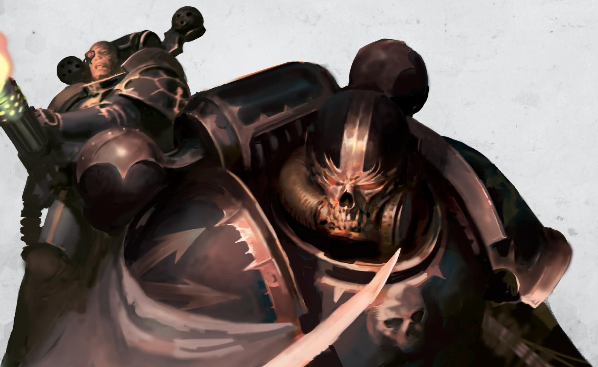

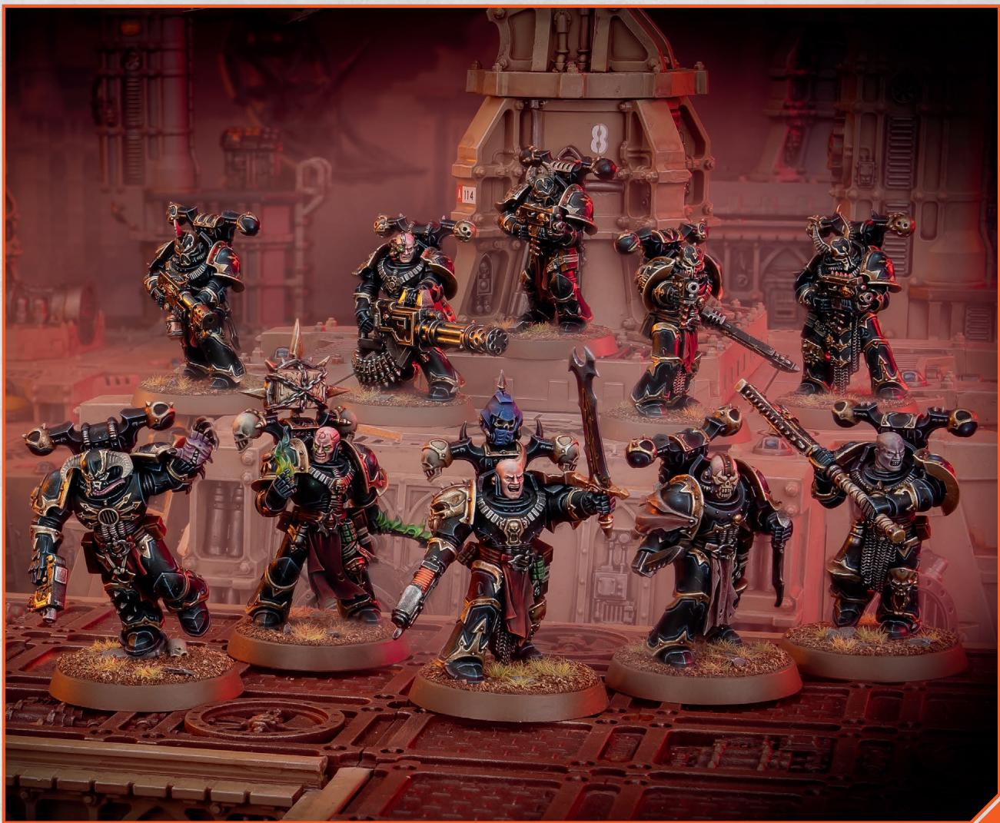

## LEGIONARY BUTCHER

Bloodthirsty madmen, Butchers are Heretic Astartes that fight without subtlety of any kind in combat. They deal furious strikes with their enormous chain axes, which can carve enemies to pieces. 

## LEGIONARY SHRIVETALON

Inflicting pain and torture becomes a near addiction for some Heretic Astartes. Those who embrace this propensity become known as Shrivetalons, and they stalk the battlefield looking for enemies to torment. 

## LEGIONARY ICON BEARER

Many Heretic Astartes kill teams include Icon Bearers – warriors bearing totems, banners or standards dedicated to the glory of the Dark Gods. 

## LEGIONARY BALEFIRE ACOLYTE

Balefire Acolytes are psykers blessed by the Chaos Gods with the dark power of the empyrean, which they turn indiscriminately upon the foe. Many also carry blades made even deadlier thanks to the power of the warp they are infused with. 

'WE HAVE THE EYE OF THE GODS. WE HAVE THE EYE OF THE DESPOILER. NONE CAN STAND AGAINST US, THOUGH SOME CHOOSE TO. I WILL NEVER TIRE OF WATCHING THE LIFE FLOW FROM THEIR EYES AS I DRIVE MY BLADE THROUGH THEIR HEART.' 

- Vrekhon Harst of the Black Legion 

## LEGIONARIES KILL TEAM

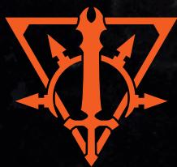

Below you will find a list of the operatives that make up a LEGIONARY kill team, including, where relevant, any weapons specified for that operative. 

## OPERATIVES

1 LEGIONARY operative selected from the following list: 

• ASPIRING CHAMPION with one option from each of the following: 

- Plasma pistol or tainted bolt pistol 

Power fist, power
maul, power weapon or
tainted chainsword 

• CHOSEN with one of the following options: 

○ Plasma pistol; daemon blade 

○ Tainted bolt pistol; daemon blade 

5 LEGIONARY operatives selected from the following list: 

• ANOINTED 

BALEFIRE ACOLYTE 

• BUTCHER 

• ICON BEARER with one of the following options: 

- Boltgun; fists 

- Bolt pistol; chainsword 

• SHRIVETALON 

• WARRIOR with one of the following options: 

- Boltgun; fists 

- Bolt pistol; chainsword 

• GUNNER with one of the following options: 

- Bolt pistol; flamer; fists 

○ Bolt pistol; meltagun; fists 

- Bolt pistol; plasma gun; fists 

• HEAVY GUNNER with one of the following options: 

- Bolt pistol; heavy bolter; fists 

○ Bolt pistol; missile launcher; fists 

- Bolt pistol; reaper chaincannon; fists 

Other than WARRIOR operatives, your kill team can only include each operative on this list once. 

## ARCHETYPES

SECURITY

SEEK & DESTROY

Archetypes are used in certain mission packs, e.g. Approved Ops. The game sequence will specify how. 

ASPIRING CHAMPION

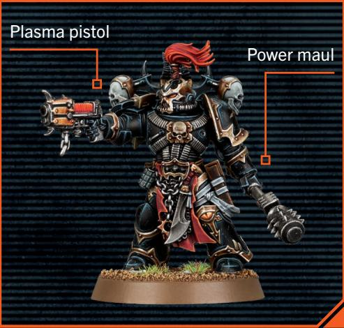

CHOSEN

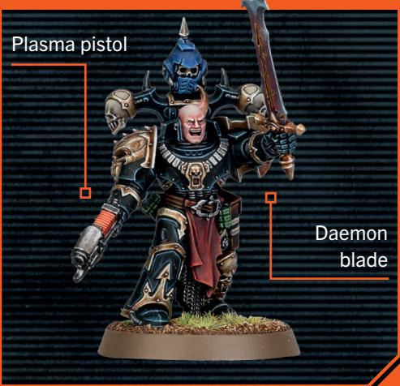

BALEFIRE ACOLYTE

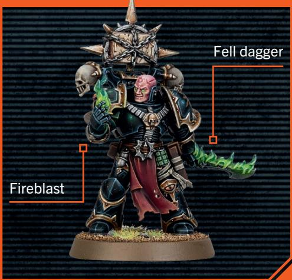

ANOINTED

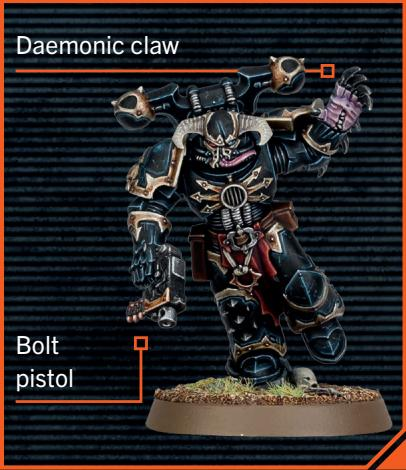

SHRIVETALON

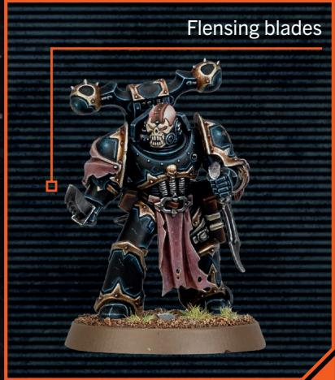

BUTCHER

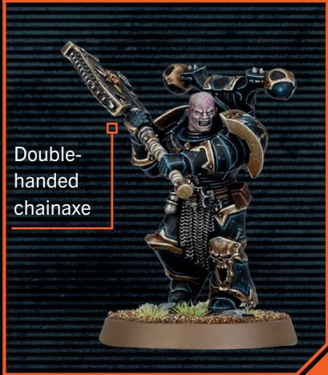

GUNNER

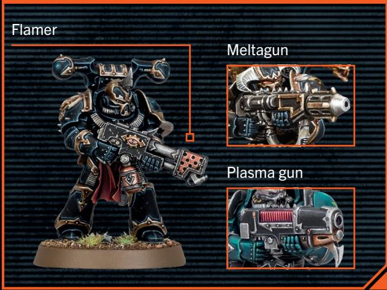

HEAVY GUNNER

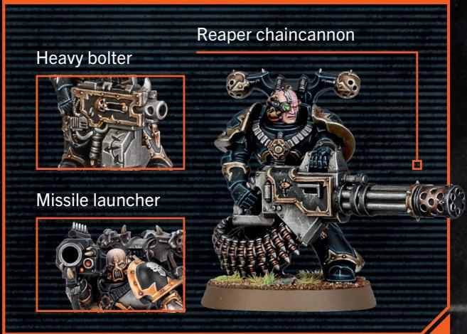

ICON BEARER

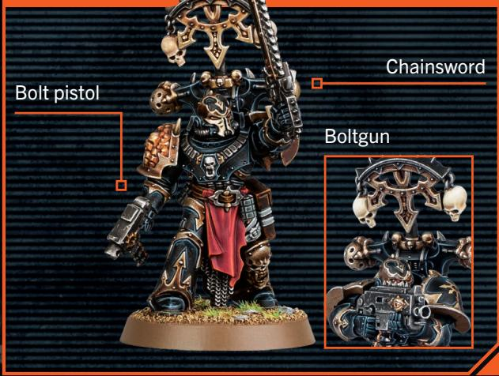

WARRIOR

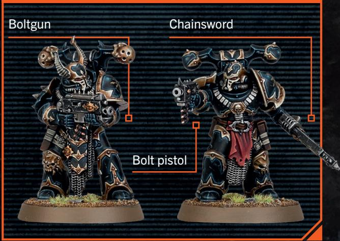
