SPACE MARINE CAPTAIN

<table><tr><td></td></tr></table>

| APL | Move | Save | Wounds |
|-----|------|------|--------|
| 3   | 6"   | 3+   | 15     |

Heroic Leader: Once per turning point, you can do one of the following:

- Use a firefight ploy for OCP if this is the specified ANGEL OF DEATH operative (excluding Command Re-roll). 

- Use the Combat Doctrine strategy ploy when you activate a friendly ANGEL OF DEATH® operative if this operative is in the killzone and isn't within control range of enemy operatives (pay its CP cost as normal). Note that you cannot do so if you've already used that ploy during this turning point. 

- Use the Adjust Doctrine firefight ploy for OCP if this operative is in the killzone and isn't within control range of enemy operatives. 

Iron Halo: Once per battle, when an attack dice inflicts Normal Dmg on this operative, you can ignore that inflicted damage. 

ANGEL OF DEATH®, IMPERIUM, ADEPTUS ASTARTES, LEADER, SPACE MARINE CAPTAIN 

40 

ASSAULT INTERCESSOR SERGEANT

| APL | Move | Save | Wounds |
|-----|------|------|--------|
| 3   | 6"   | 3+   | 15     |

<table><tr><td></td><td>NAME</td><td>ATK</td><td>HIT</td><td>DMG</td><td>WR</td></tr><tr><td></td><td>Hand flamer</td><td>4</td><td>2+</td><td>3/3</td><td>Range 6&quot;, Saturate, Torrent 1&quot;</td></tr><tr><td></td><td>Heavy bolt pistol</td><td>4</td><td>3+</td><td>3/4</td><td>Range 8&quot;, Piercing Crits 1</td></tr><tr><td></td><td>Plasma pistol (standard)</td><td>4</td><td>3+</td><td>3/5</td><td>Range 8&quot;, Piercing 1</td></tr><tr><td></td><td>Plasma pistol (supercharge)</td><td>4</td><td>3+</td><td>4/5</td><td>Range 8&quot;, Hot, Lethal 5+, Piercing 1</td></tr><tr><td></td><td>Chainsword</td><td>5</td><td>3+</td><td>4/5</td><td>-</td></tr><tr><td></td><td>Power fist</td><td>5</td><td>4+</td><td>5/7</td><td>Brutal</td></tr><tr><td></td><td>Power weapon</td><td>5</td><td>3+</td><td>4/6</td><td>Lethal 5+</td></tr><tr><td></td><td>Thunder hammer</td><td>5</td><td>4+</td><td>5/6</td><td>Shock, Stun</td></tr></table>

RULES CONTINUE ON OTHER SIDE ▶ 

ANGEL OF DEATH®, IMPERIUM, ADEPTUS ASTARTES, LEADER, ASSAULT INTERCESSOR, SERGEANT 

32 

## ASSAULT INTERCESSOR SERGEANT

| APL | Move | Save | Wounds |
|-----|------|------|--------|
| 3   | 6"   | 3+   | 15     |

Doctrine Warfare: You can do each of the following once per battle:

- Whenever you would use the Combat Doctrine strategy ploy and then select Assault, if this operative is in the killzone, it costs you OCP.

- Whenever you would use the Combat Doctrine strategy ploy and then select Tactical, if this operative is in the killzone, it costs you OCP.

Chapter Veteran: At the end of the Select Operatives step, if this operative is selected for deployment, select one additional CHAPTER TACTIC for it to have for the battle. Unlike primary and secondary CHAPTER TACTICS, you don't have to select the same one for each battle in a campaign or tournament.

INTERCESSOR SERGEANT

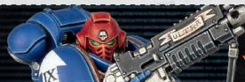

| APL | Move | Save | Wounds |
|-----|------|------|--------|
| 3   | 6"   | 3+   | 15     |

<table><tr><td></td><td>NAME</td><td>ATK</td><td>HIT</td><td>DMG</td><td>WR</td></tr><tr><td></td><td>Auto bolt rifle</td><td>4</td><td>3+</td><td>3/4</td><td>Torrent 1&quot;</td></tr><tr><td></td><td>Bolt rifle</td><td>4</td><td>3+</td><td>3/4</td><td>Piercing Crits 1</td></tr><tr><td></td><td>Stalker bolt rifle (heavy)</td><td>4</td><td>3+</td><td>3/5</td><td>Heavy (Dash only), Lethal 5+, Piercing Crits 1</td></tr><tr><td></td><td>Stalker bolt rifle (mobile)</td><td>4</td><td>3+</td><td>3/4</td><td>-</td></tr><tr><td></td><td>Chainsword</td><td>4</td><td>3+</td><td>4/5</td><td>-</td></tr><tr><td></td><td>Fists</td><td>4</td><td>3+</td><td>3/4</td><td>-</td></tr><tr><td></td><td>Power fist</td><td>4</td><td>4+</td><td>5/7</td><td>Brutal</td></tr><tr><td></td><td>Power weapon</td><td>4</td><td>3+</td><td>4/6</td><td>Lethal 5+</td></tr><tr><td></td><td>Thunder hammer</td><td>4</td><td>4+</td><td>5/6</td><td>Shock, Stun</td></tr></table>

RULES CONTINUE ON OTHER SIDE ▶ 

ANGEL OF DEATH, IMPERIUM, APEPTUS ASTARTES, LEADER, INTERCESSOR, SERGEANT 

32 

## INTERCESSOR SERGEANT

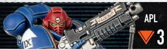

| APL | Move | Save | Wounds |
|-----|------|------|--------|
| 3   | 6"   | 3+   | 15     |

Doctrine Warfare: You can do each of the following once per battle:

- Whenever you would use the Combat Doctrine strategy ploy and then select Devastator, if this operative is in the killzone, it costs you OCP.

- Whenever you would use the Combat Doctrine strategy ploy and then select Tactical, if this operative is in the killzone, it costs you OCP.

Chapter Veteran: At the end of the Select Operatives step, if this operative is selected for deployment, select one additional

CHAPTER TACTIC for it to have for the battle. Unlike primary and secondary CHAPTER TACTICS, you don't have to select the same one for each battle in a campaign or tournament.

ASSAULT INTERCESSOR GRENADIER

| APL | Move | Save | Wounds |
|-----|------|------|--------|
| 3   | 6"   | 3+   | 14     |

<table><tr><td>NAME</td><td>ATK</td><td>HIT</td><td>DMG</td><td>WR</td></tr><tr><td>Heavy bolt pistol</td><td>4</td><td>3+</td><td>3/4</td><td>Range 8&quot;, Piercing Crits 1</td></tr><tr><td>Chainsword</td><td>5</td><td>3+</td><td>4/5</td><td>-</td></tr></table>

Grenadier: This operative can use frag and krak grenades (see universal equipment). Doing so doesn't count towards any limited uses you have (i.e. if you also select those grenades from equipment for other operatives). Whenever it's doing so, improve the Hit stat of that weapon by 1. 

ANGEL OF DEATH®, IMPERIUM, ADEPTUS ASTARTES, ASSAULT INTERCESSOR, GRENADIER 

32 

ASSAULT INTERCESSOR WARRIOR

| APL | Move | Save | Wounds |
|-----|------|------|--------|
| 3   | 6"   | 3+   | 14     |

<table><tr><td>NAME</td><td>ATK</td><td>HIT</td><td>DMG</td><td>WR</td></tr><tr><td>Heavy bolt pistol</td><td>4</td><td>3+</td><td>3/4</td><td>Range 8&quot;, Piercing Crits 1</td></tr><tr><td>Chainsword</td><td>5</td><td>3+</td><td>4/5</td><td>-</td></tr></table>

ANGEL OF DEATHO, IMPERIUM, ADEPTUS ASTARTES, ASSAULT INTERCESSOR, WARRIOR 

32 

HEAVY INTERCESSOR GUNNER

| APL | Move | Save | Wounds |
|-----|------|------|--------|
| 3   | 5"   | 3+   | 18     |

<table><tr><td>NAME</td><td>ATK</td><td>HIT</td><td>DMG</td><td>WR</td></tr><tr><td>Bolt pistol</td><td>4</td><td>3+</td><td>3/4</td><td>Range 8&quot;</td></tr><tr><td>Heavy bolter (focused)</td><td>5</td><td>3+</td><td>4/5</td><td>Piercing Crits 1</td></tr><tr><td>Heavy bolter (sweeping)</td><td>4</td><td>3+</td><td>4/5</td><td>Piercing Crits 1, Torrent 1&quot;</td></tr><tr><td>Fists</td><td>4</td><td>3+</td><td>3/4</td><td>-</td></tr></table>

40 

INTERCESSOR GUNNER

| APL | Move | Save | Wounds |
|-----|------|------|--------|
| 3   | 6"   | 3+   | 14     |

<table><tr><td></td><td>NAME</td><td>ATK</td><td>HIT</td><td>DMG</td><td>WR</td></tr><tr><td></td><td>Auto bolt rifle</td><td>4</td><td>3+</td><td>3/4</td><td>Torrent 1&quot;</td></tr><tr><td></td><td>Auxiliary grenade launcher (frag)</td><td>4</td><td>3+</td><td>2/4</td><td>Blast 2&quot;</td></tr><tr><td></td><td>Auxiliary grenade launcher (krak)</td><td>4</td><td>3+</td><td>4/5</td><td>Piercing 1</td></tr><tr><td></td><td>Bolt rifle</td><td>4</td><td>3+</td><td>3/4</td><td>Piercing Crits 1</td></tr><tr><td></td><td>Stalker bolt rifle (heavy)</td><td>4</td><td>3+</td><td>3/5</td><td>Heavy (Dash only), Lethal 5+, Piercing Crits 1</td></tr><tr><td></td><td>Stalker bolt rifle (mobile)</td><td>4</td><td>3+</td><td>3/4</td><td>-</td></tr><tr><td></td><td>Fists</td><td>4</td><td>3+</td><td>3/4</td><td>-</td></tr></table>

ANGEL OF DEATH®, IMPERIUM, ADEPTUS ASTARTES, INTERCESSOR, GUNNER 

32 

INTERCESSOR WARRIOR

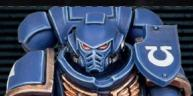

| APL | Move | Save | Wounds |
|-----|------|------|--------|
| 3   | 6"   | 3+   | 14     |

<table><tr><td></td><td>NAME</td><td>ATK</td><td>HIT</td><td>DMG</td><td>WR</td></tr><tr><td></td><td>Auto bolt rifle</td><td>4</td><td>3+</td><td>3/4</td><td>Torrent 1&quot;</td></tr><tr><td></td><td>Bolt rifle</td><td>4</td><td>3+</td><td>3/4</td><td>Piercing Crits 1</td></tr><tr><td></td><td>Stalker bolt rifle (heavy)</td><td>4</td><td>3+</td><td>3/5</td><td>Heavy (Dash only), Lethal 5+, Piercing Crits 1</td></tr><tr><td></td><td>Stalker bolt rifle (mobile)</td><td>4</td><td>3+</td><td>3/4</td><td>-</td></tr><tr><td></td><td>Fists</td><td>4</td><td>3+</td><td>3/4</td><td>-</td></tr></table>

ANGEL OF DEATH®, IMPERIUM, ADEPTUS ASTARTES, INTERCESSOR, WARRIOR 

32 

ELIMINATOR SNIPER

| APL | Move | Save | Wounds |
|-----|------|------|--------|
| 3   | 6"   | 3+   | 14     |

<table><tr><td></td><td>NAME</td><td>ATK</td><td>HIT</td><td>DMG</td><td>WR</td></tr><tr><td></td><td>Bolt pistol</td><td>4</td><td>3+</td><td>3/4</td><td>Range 8&quot;</td></tr><tr><td></td><td>Bolt sniper rifle (executioner)</td><td>4</td><td>2+</td><td>3/4</td><td>Heavy (Dash only), Saturate, Seek Light, Silent</td></tr><tr><td></td><td>Bolt sniper rifle (hyperfrag)</td><td>4</td><td>2+</td><td>2/4</td><td>Blast 1&quot;, Heavy (Dash only), Silent</td></tr><tr><td></td><td>Bolt sniper rifle (mortis)</td><td>4</td><td>2+</td><td>3/3</td><td>Devastating 3, Heavy (Dash only), Piercing 1, Silent</td></tr><tr><td></td><td>Fists</td><td>4</td><td>3+</td><td>3/4</td><td>-</td></tr></table>

RULES CONTINUE ON OTHER SIDE 

ANGEL OF DEATH, IMPERIUM, ADEPTUS ASTARTES, ELIMINATOR, SNIPER 

40 

## ELIMINATOR SNIPER

| APL | Move | Save | Wounds |
|-----|------|------|--------|
| 3   | 6"   | 3+   | 14     |

Camo Cloak: Whenever an operative is shooting this operative, ignore the Saturate weapon rule. This operative has the Stealthy CHAPTER TACTIC. If you selected that CHAPTER TACTIC, you can do both of its options (i.e. retain two cover saves – one normal and one critical success). 

1AP 

## OPTICS

Until the start of this operative's next activation, whenever it's shooting, enemy operatives cannot be obscured. 

This operative cannot perform this action while within control range of an enemy operative. 

# ANGELS OF DEATH KILL TEAM

ARCHETYPE: SECURITY, SEEK & DESTROY 

## OPERATIVES

1 ANGEL OF DEATH operator selected from the following list: 

• ASSAULT INTERCESSOR SERGEANT with one option from each of the following: 

- Hand flamer or heavy bolt pistol 

- Chainsword, power fist, power weapon or thunder hammer 

Or the following option: 

- Plasma pistol; chainsword 

• INTERCESSOR SERGEANT with one option from each of the following: 

- Auto bolt rifle, bolt rifle or stalker bolt rifle 

- Chainsword, fists, power fist, power weapon or thunder hammer 

• SPACE MARINE CAPTAIN 

CONTINUES ON OTHER SIDE 

5 ANGEL OF DEATH-operatives selected from the following list: 

• ASSAULT INTERCESSOR GRENADIER 

• ASSAULT INTERCESSOR WARRIOR 

• ELIMINATOR SNIPER 

• HEAVY INTERCESSOR GUNNER 

• INTERCESSOR GUNNER with auxiliary grenade launcher and one of the following options: 

- Auto bolt rifle; fists 

- Bolt rifle; fists 

○ Stalker bolt rifle; fists 

• INTERCESSOR WARRIOR with one of the following options: 

○ Auto bolt rifle; fists 

- Bolt rifle; fists 

- Stalker bolt rifle; fists 

Other than WARRIOR operatives, your kill team can only include each operative on this list once. 

Some ANGEL OF DEATH® rules refer to a 'bolt weapon'. This is a ranged weapon that includes 'bolt' in its name, e.g. stalker bolt rifle, heavy bolt pistol, etc. 

## ANGEL OF DEATH FACTION RULE

## CHAPTER TACTICS

Each Space Marine Chapter is a martial brotherhood with its own combat philosophies, suited to the unique skills and temperaments of its battle-brothers. These tenets of war may be clothed in esoteric rituals built up over thousands of years, but remain as brutally effective as when they were first laid down. 

When selecting your kill team, select a primary and secondary CHAPTER TACTIC for friendly ANGEL OF DEATH® operatives to gain for the battle. Multiple instances of the same CHAPTER TACTIC aren't cumulative. 

Designer's Note: If you're playing a series of games, i.e. a campaign or tournament, you must select the same primary and secondary CHAPTER TACTIC for every battle (you can still change the secondary with the Adaptive Tactics strategy ploy). 

CHAPTER TACTIC OPTIONS ARE PRESENTED ON THEIR OWN CARD 

## ANGEL OF DEATH FACTION RULE

## CHAPTER TACTICS

## 1. AGGRESSIVE

This operative's melee weapons have the Rending weapon rule. 

## 2. DUELLER

Whenever this operative is fighting or retaliating, each of your normal successes can block one unresolved critical success (unless the enemy operative's weapon has the Brutal weapon rule). 

## 3. RESOLUTE

You can ignore any changes to this operative's APL stat and it isn't affected by enemy operatives' Shock weapon rule. 

CONTINUES ON OTHER SIDE 

## 4. STEALTHY

Whenever an operative is shooting this operative, if you can retain any cover saves, you can retain one additional cover save, or you can retain one cover save as a critical success instead. This isn't cumulative with improved cover saves from Vantage terrain. 

## 5. MOBILE

- This operative can perform the Fall Back action for 1 less AP. 

- This operative can perform the Charge action while within control range of an enemy operative, and can leave that operative's control range to do so (but then normal requirements for that move apply). 

## 6. HARDY

Whenever an operative is shooting this operative, defence dice results of 5+ are critical successes. Whenever this operative is retaliating, the first time an attack dice inflicts Normal Dmg of 3 or more on this operative during that sequence, that dice inflicts 1 less damage on it. 

CONTINUES ON OTHER SIDE 

## ANGEL OF DEATH FACTION RULE

## ASTARTES

These genetically modified superhumans are made for one purpose: war. 

During each friendly ANGEL OF DEATH operative's activation, it can perform either two Shoot actions or two Fight actions. If it's two Shoot actions, a bolt weapon must be selected for at least one of them, and if it's a bolt sniper rifle or heavy bolter, 1 additional AP must be spent for the second action if both actions are using that weapon. 

Each friendly ANGEL OF DEATH operative can counteract regardless of its order. 

## 7. SHARPSHOOTER

Whenever this operative is shooting during an activation in which it hasn't performed the Charge, Fall Back or Reposition action, its bolt weapons have the Accurate 1 and Severe weapon rules. 

## 8. SIEGE SPECIALIST

This operative's ranged weapons have the Saturate weapon rule. Whenever this operative is fighting or retaliating, enemy operatives cannot assist. 

## ANGEL OF DEATH STRATEGY PLOY

## COMBAT DOCTRINE

Space Marines hold the teachings of the Codex Astartes in highest esteem, employing its flexible combat doctrines to annihilate their enemies. 

Select one COMBAT DOCTRINE from those presented below. Whenever a friendly ANGEL OF DEATH operative is x, its weapons have the Balanced weapon rule. X is the COMBAT DOCTRINE you selected. 

- Devastator Doctrine: Shooting an operative more than 6" from it. 

- Tactical Doctrine: Shooting an operative within 6" of it. 

• Assault Doctrine: Fighting or retaliating. 

## ANGEL OF DEATH STRATEGY PLOY

## AND THEY SHALL KNOW NO FEAR

Space Marines possess extraordinary courage and are utterly unflinching in the face of terrifying horrors and overwhelming odds. 

You can ignore any changes to the stats of friendly ANGEL OF DEATH-operatives from being injured (including their weapons' stats). 

## ANGEL OF DEATH STRATEGY PLOY

## ADAPTIVE TACTICS

There are few more tactically flexible warriors than the Adeptus Astartes. Supplementing the teachings of the Codex Astartes with their own experience, Space Marines may adjust their strategies at a moment's notice. 

Change your secondary CHAPTER TACTIC. Note this ploy only lasts until the end of the turning point, at which point your original secondary CHAPTER TACTIC returns. 

## ANGEL OF DEATH STRATEGY PLOY

## INDOMITUS

This is the Era Indomitus. The Imperium wages galaxy-spanning crusades to drive back the horrors that plague it, and the battle-brothers of the Adeptus Astartes are spurred on by this righteous purpose. 

Whenever an operative is shooting a friendly ANGEL OF DEATH operator, if you roll two or more fails, you can discard one of them to retain another as a normal success instead. 

## ANGEL OF DEATH FIREFIGHT PLOY

## ADJUST DOCTRINE

Adeptus Astartes kill teams adapt their strategies on the fly to overcome the foe. Swiftly traded hand signals and abrupt vox exchanges herald a shift in doctrine. 

Use this firefight ploy during a friendly ANGEL OF DEATH® operative's activation, before or after it performs an action. If you've used the Combat Doctrine strategy ploy during this turning point, change the COMBAT DOCTRINE you selected. 

## ANGEL OF DEATH

## FIREFIGHT PLOY

## ANGEL OF DEATH

## FIREFIGHT PLOY

## TRANSHUMAN PHYSIOLOGY

The genetically modified physiology of a Space Marine is capable of resisting wounds that would kill a lesser being. 

Use this firefight ploy when an operative is shooting a friendly ANGEL OF DEATH operative, in the Roll Defence Dice step. You can retain one of your normal successes as a critical success instead. 

## SHOCK ASSAULT

The Adeptus Astartes strike with exceptional speed and strength, the roar of chainswords and brutal assaults spelling death for their foes. 

Use this firefight ploy when a friendly ANGEL OF DEATH® operative is performing the Fight action during an activation in which it performed the Charge action, at the start of the Resolve Attack Dice step. Until the end of that action: 

- Its melee weapon has the Shock weapon rule. 

- The first time you strike during that sequence, inflict 1 additional damage (to a maximum of 7). 

## ANGEL OF DEATH

## FIREFIGHT PLOY

## ANGEL OF DEATH

## FACTION EQUIPMENT

## WRATH OF VENGEANCE

When roused to anger, a battle-brother of the Adeptus Astartes may be spurred to acts of extraordinary strength and athleticism. 

Use this firefight ploy when a friendly ANGEL OF DEATH operative is counteracting. It can perform an additional 1AP action for free during that counteraction, but both actions must be different. 

## PURITY SEALS

Awarded by the Chapter's Chaplains, purity seals are inscribed with blessings and inspire the bearer to fight with increased vigour. 

Once per turning point, when a friendly ANGEL OF DEATH operator is shooting, fighting or retaliating, if you roll two or more fails, you can discard one of them to retain another as a normal success instead. 

# ANGEL OF DEATH FACTION EQUIPMENT

## CHAPTER RELIQUARIES

Many Space Marines bear macabre relics taken from the bodies of their fallen. Those who bear these inspirational items fight all the harder to honour the sacrifice of their battle-brothers. 

You can use the Wrath of Vengeance firefight ploy for OCP if the specified friendly operative has an Engage order. 

# ANGEL OF DEATH FACTION EQUIPMENT

## TILTING SHIELDS

As well as displaying company colours and personal heraldry, a Space Marine's tilting plate serves to protect the bearer in the press of melee combat. 

Once per turning point, when a friendly ANGEL OF DEATH® operative is fighting or retaliating, after your opponent rolls their attack dice, but before re-rolls, you can use this rule. If you do, your opponent cannot retain attack dice results of less than 6 as critical successes during that sequence (e.g. as a result of the Lethal, Rending or Severe weapon rules). 

## ANGEL OF DEATH FACTION EQUIPMENT

## AUSPEX

Auspexes come in many forms. These scanning devices can detect motion, analyse atmospheric conditions and reveal heat signatures. 

Once per turning point, when a friendly ANGEL OF DEATH® operative performs the Shoot action and you're selecting a valid target, you can use this rule. If you do, until the end of the activation/counteraction, enemy operatives within 8" of that friendly operative cannot be obscured. 

## NOTES:

Rules will be periodically updated to maintain fair balance and interact more smoothly with the game. Rules changes will be updated directly into online documents and then listed below. Any minor changes to standardise wording that don't have any practical impact on the rule will be updated directly into online documents but not be listed here. 

## ERRATA

## JANUARY '26

This section collects amendments to the rules. Amended text for clarification and edits are shown in blue, while amended text for balance updates are shown in magenta. 

## HEAVY INTERCESSOR GUNNER OPERATIVE, WEAPONS LIST

'Bolt pistol' weapon added. 

## TEAM SELECTION

Following sentence and asterisks on ELIMINATOR SNIPER and HEAVY INTERCESSOR GUNNER deleted: 

'You cannot select more than one of these operatives combined.' 

## FACTION RULES, CHAPTER TACTICS

## Dueller

Changed to read: 

'Whenever this operative is fighting or retaliating, each of your normal successes can block one unresolved critical success (unless the enemy operative's weapon has the Brutal weapon rule).' 

## Resolute

Changed to read: 

'You can ignore any changes to this operative's APL stat and it isn't affected by enemy operatives' Shock weapon rule.' 

## Hardy

Additional sentence added: 

'Whenever this operative is retaliating, the first time an attack dice inflicts Normal Dmg of 3 or more on this operative during that sequence, that dice inflicts 1 less damage on it.' 

## Sharpshooter

Relevant parts changed to read: 

‘[...] its bolt weapons have the Accurate 1 and Severe weapon rules.’ 

## Siege Specialist

Additional sentence added: 

'Whenever this operative is fighting or retaliating, enemy operatives cannot assist.' 

## INTERCESSOR SERGEANT OPERATIVE, DOCTRINE WARFARE RULE

Changed to read: 

'You can do each of the following once per battle: 

- When you would use the Combat Doctrine strategy ploy and then select Devastator, if this operative is in the killzone, it costs you OCP. 

- When you would use the Combat Doctrine strategy ploy and then select Tactical, if this operative is in the killzone, it costs you OCP.' 

## ASSAULT INTERCESSOR SERGEANT OPERATIVE, DOCTRINE WARFARE RULE

Changed to read: 

'You can do each of the following once per battle: 

- When you would use the Combat Doctrine strategy ploy and then select Assault, if this operative is in the killzone, it costs you OCP. 

- When you would use the Combat Doctrine strategy ploy and then select Tactical, if this operative is in the killzone, it costs you OCP.' 

## HEAVY INTERCESSOR GUNNER OPERATIVE

Move stat changed to '5'. 

## SPACE MARINE CAPTAIN OPERATIVE, HEROIC LEADER RULE

Changed to read: 

'Once per turning point, you can do one of the following: 

- Use a firefight ploy for OCP if this is the specified ANGEL OF DEATH operative (excluding Command Re-roll). 

- Use the Combat Doctrine strategy ploy when you activate a friendly ANGEL OF DEATH operative if this operative is in the killzone and isn't within control range of enemy operatives (pay its CP cost as normal). Note that you cannot do so if you've already used that ploy during this turning point. 

- Use the Adjust Doctrine firefight ploy for OCP if this operative is in the killzone and isn't within control range of enemy operatives.' 

## FACTION EQUIPMENT, TILTING SHIELDS

Relevant part of first sentence changed to read: 

‘[...] after your opponent rolls their attack dice, but before re-rolls, you can use this rule.’ 

## ANGELS OF DEATH OPERATIVES

Genetically modified transhuman warriors, Space Marines are amongst Humanity's most elite fighting forces. Angels of Death kill teams are composed of elite specialists trained in myriad forms of combat, who are capable of overcoming almost any foe. 

## SPACE MARINE CAPTAIN

To reach the rank of Captain, a Space Marine must master war. They are equally adept at conducting planet-spanning military campaigns as they are at dispatching foes in expertly fought duels. 

## ASSAULT INTERCESSOR SERGEANT

These mission leaders understand the optimal moment to unleash charges. They are exemplars in the press of melee, rending foes in twain with their deadly close combat weapons. 

## INTERCESSOR SERGEANT

Intercessor Sergeants lead their teams in levelling salvoes of firepower against targets in ever-changing killzones. They often carry specialist weaponry into the fray to support their battle-brothers. 

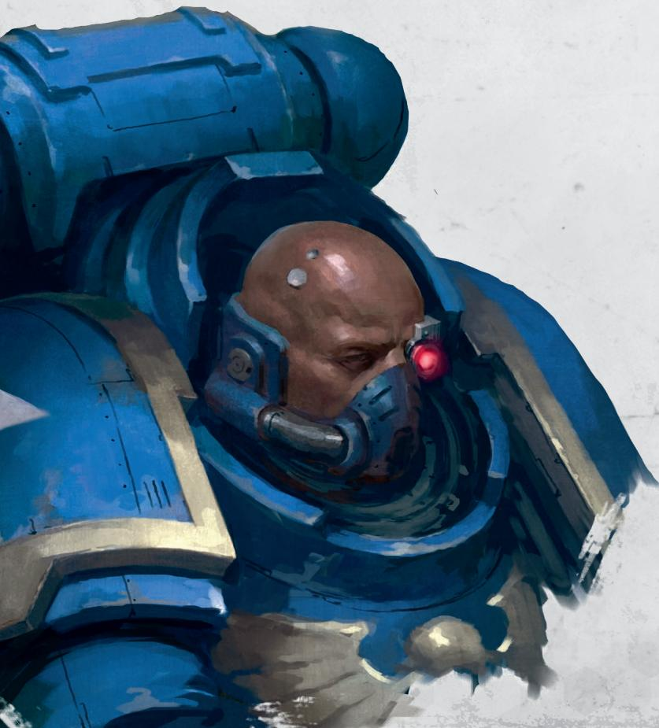

## ASSAULT INTERCESSOR WARRIOR

Protected by Mk X Tacticus armour, Assault Intercessor Warriors charge into battle swinging large chainswords and firing mass-reactive shells from their pistols. 

## ASSAULT INTERCESSOR GRENADIER

Equipped with an array of deadly grenades, these specialists provide close-range support when facing swarms of lesser foes or heavily armoured targets. 

## INTERCESSOR WARRIOR

Intercessor Warriors lay down punishing volleys of fire from their bolt rifles. Their tactics and wargear are adaptable to countless situations, making them a core asset for any Intercession Squad. 

## INTERCESSOR GUNNER

These specialists provide long-range supporting fire from their rifle's underslung auxiliary grenade launcher. They are capable of delivering explosive charges that inflict maximum devastation on the most densely defended or shielded positions. 

## ELIMINATOR SNIPER

Eliminators wield specialised sniper rifles with ammunition for every enemy. These range from heavy-cored Mortis rounds that make a mockery of armour, to explosive fragmentation shells that devastate clustered targets. 

## HEAVY INTERCESSOR GUNNER

Heavy Intercessors are akin to walking gun emplacements. Their heavy bolters allow them to shatter enemies with punishing fusillades of explosive fire, either sweeping over massed troops or in focused volleys. 

# ANGELS OF DEATH KILL TEAM

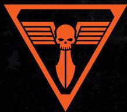

Below you will find a list of the operatives that make up an ANGEL OF DEATH kill team, including, where relevant, any weapons specified for that operative. 

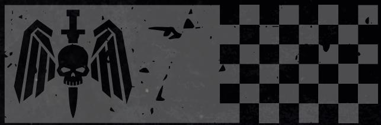

## OPERATIVES

1 ANGEL OF DEATH® operative selected from the following list: 

• ASSAULT INTERCESSOR SERGEANT with one option from each of the following: 

- Hand flamer or heavy bolt pistol 

- Chainsword, power fist, power weapon or thunder hammer 

• Or the following option: 

- Plasma pistol; chainsword 

- INTERCESSOR SERGEANT with one option from each of the following: 

- Auto bolt rifle, bolt rifle or stalker bolt rifle 

- Chainsword, fists, power fist, power weapon or thunder hammer 

• SPACE MARINE CAPTAIN 

5 ANGEL OF DEATH® operatives selected from the following list: 

• ASSAULT INTERCESSOR GRENADIER 

• ASSAULT INTERCESSOR WARRIOR 

• ELIMINATOR SNIPER 

• HEAVY INTERCESSOR GUNNER 

• INTERCESSOR GUNNER with auxiliary grenade launcher and one of the following options: 

○ Auto bolt rifle; fists 

- Bolt rifle; fists 

○ Stalker bolt rifle; fists 

• INTERCESSOR WARRIOR with one of the following options: 

- Auto bolt rifle; fists 

- Bolt rifle; fists 

- Stalker bolt rifle; fists 

Other than WARRIOR operatives, your kill team can only include each operative on this list once. 

## ARCHETYPES

SECURITY

SEEK & DESTROY

Archetypes are used in certain mission packs, e.g. Approved Ops. The game sequence will specify how. 

Some ANGEL OF DEATH $^{★}$ rules refer to a ‘bolt weapon’. This is a ranged weapon that includes ‘bolt’ in its name, e.g. stalker bolt rifle, heavy bolt pistol, etc. 

ASSAULT INTERCESSOR SERGEANT

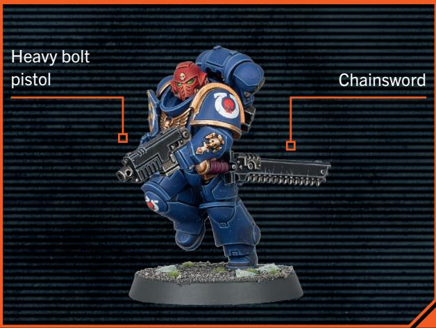

INTERCESSOR SERGEANT

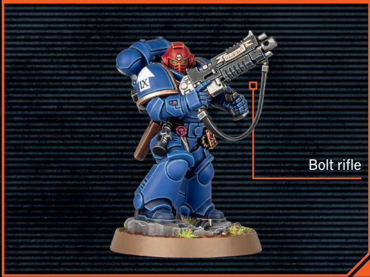

SPACE MARINE CAPTAIN

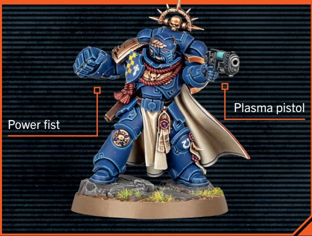

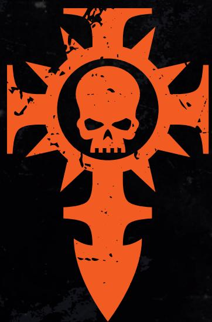

ASSAULT INTERCESSOR GRENADIER

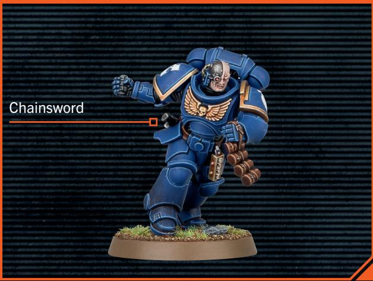

ASSAULT INTERCESSOR WARRIOR

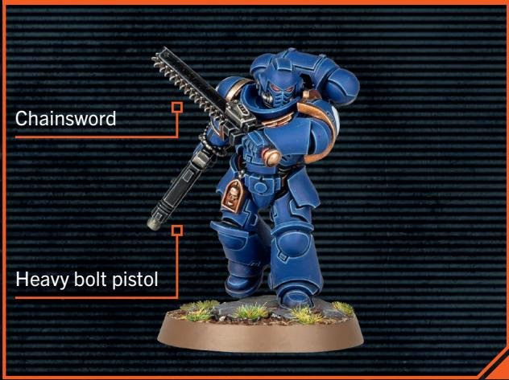

ELIMINATOR SNIPER

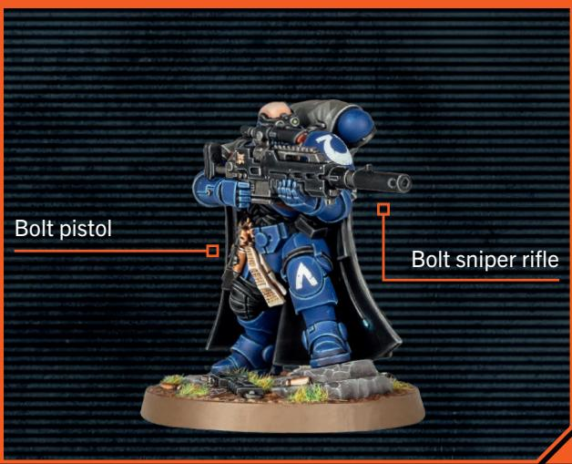

HEAVY INTERCESSOR GUNNER

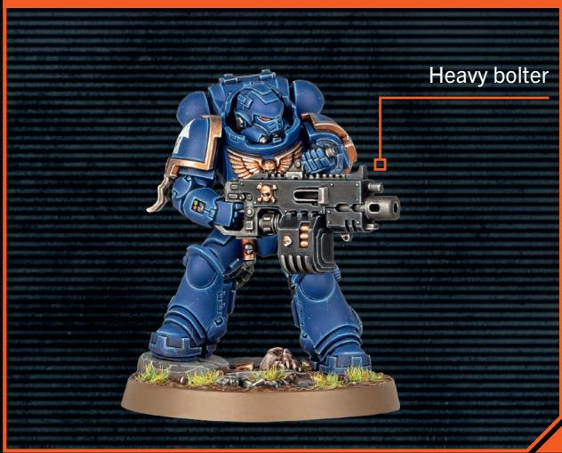

INTERCESSOR GUNNER

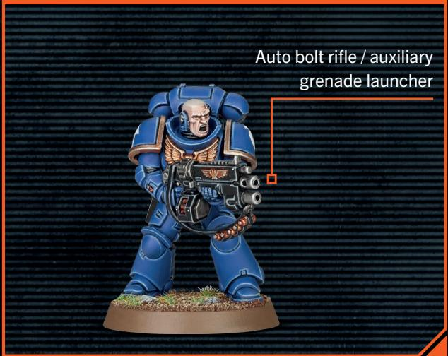

INTERCESSOR WARRIOR

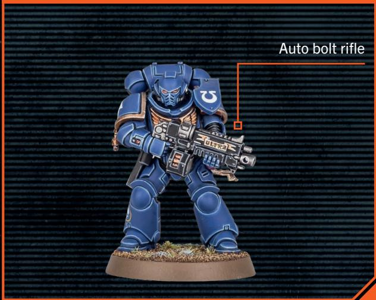

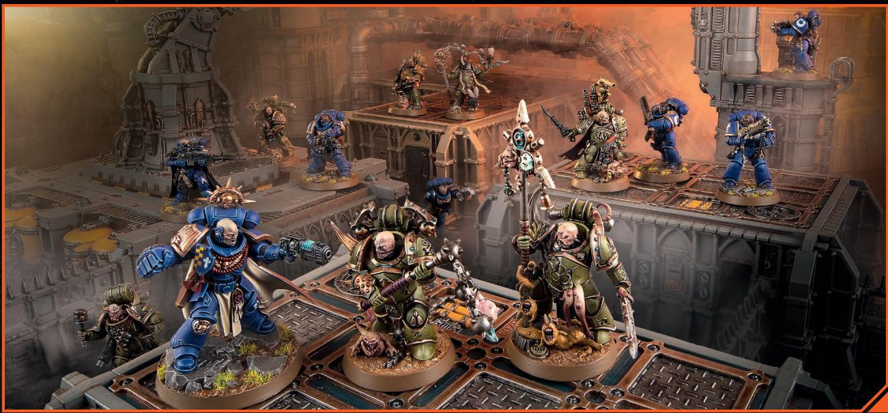
