PLAGUE MARINE CHAMPION

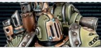

| APL | Move | Save | Wounds |
|-----|------|------|--------|
| 3   | 5"   | 3+   | 15     |

<table><tr><td>NAME</td><td>ATK</td><td>HIT</td><td>DMG</td><td>WR</td></tr><tr><td>Plasma pistol (standard)</td><td>4</td><td>3+</td><td>3/5</td><td>Range 8&quot;, Piercing 1</td></tr><tr><td>Plasma pistol (supercharge)</td><td>4</td><td>3+</td><td>4/5</td><td>Range 8&quot;, Hot, Lethal 5+, Piercing 1</td></tr><tr><td>Plague sword</td><td>5</td><td>3+</td><td>4/5</td><td>Severe, Poison*, Toxic*</td></tr></table>

Grandfather's Blessing: Whenever an enemy operative that has one of your Poison tokens loses one or more wounds within 7" of this operative, this operative regains up to an equal number of lost wounds (to a maximum of 3 lost wounds per turning point, and only if this operative isn't incapacitated). 

*Toxic: Whenever this operative is using this weapon against an enemy operative that has one of your Poison tokens, add 1 to both Dmg stats of this weapon. 

PLAGUE MARINE®, CHAOS, HERETIC ASTARTES, LEADER, CHAMPION 

32 

PLAGUE MARINE BOMBARDIER

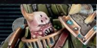

| APL | Move | Save | Wounds |
|-----|------|------|--------|
| 3   | 5"   | 3+   | 14     |

<table><tr><td></td><td>NAME</td><td>ATK</td><td>HIT</td><td>DMG</td><td>WR</td></tr><tr><td></td><td>Boltgun</td><td>4</td><td>3+</td><td>3/4</td><td>-</td></tr><tr><td></td><td>Fists</td><td>4</td><td>3+</td><td>3/4</td><td>-</td></tr></table>

Grenadier: This operative can use blight and krak grenades (see faction and universal equipment). Doing so doesn't count towards any limited uses you have (i.e. if you also select those grenades from equipment for other operatives). Whenever it's doing so, improve the Hit stat of that weapon by 1 and blight grenades have the Toxic weapon rule (see right). 

*Toxic: Whenever this operative is using this weapon against an enemy operative that has one of your Poison tokens, add 1 to both Dmg stats of this weapon. 

PLAGUE MARINE®, CHAOS, HERETIC ASTARTES, BOMBARDIER 

32 

PLAGUE MARINE FIGHTER

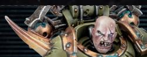

| APL | Move | Save | Wounds |
|-----|------|------|--------|
| 3   | 5"   | 3+   | 14     |

<table><tr><td>NAME</td><td>ATK</td><td>HIT</td><td>DMG</td><td>WR</td></tr><tr><td>Bolt pistol</td><td>4</td><td>3+</td><td>3/4</td><td>Range 8&quot;</td></tr><tr><td>Flail of Corruption</td><td>5</td><td>3+</td><td>4/5</td><td>Brutal, Severe, Shock, Poison*</td></tr></table>

## FLAIL

1AP 

Inflict D3+2 damage on each other operative that's both visible to and within 2" of this operative. Roll separately for each: if it's an enemy operative, if the D3 result is a 3, that enemy operative also gains one of your Poison tokens (if it doesn't already have one). 

For the purposes of action restrictions and the Astartes faction rule, this action is treated as a Fight action. This operative cannot perform this action while it has a Conceal order. 

PLAGUE MARINE®, CHAOS, HERETIC ASTARTES, FIGHTER 

32 

PLAGUE MARINE HEAVY GUNNER

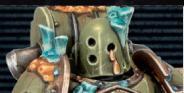

| APL | Move | Save | Wounds |
|-----|------|------|--------|
| 3   | 5"   | 3+   | 14     |

<table><tr><td>NAME</td><td>ATK</td><td>HIT</td><td>DMG</td><td>WR</td></tr><tr><td>Bolt pistol</td><td>4</td><td>3+</td><td>3/4</td><td>Range 8&quot;</td></tr><tr><td>Plague spewer</td><td>5</td><td>2+</td><td>3/3</td><td>Range 7&quot;, Saturate, Severe, Torrent 2&quot;, Poison*</td></tr><tr><td>Fists</td><td>4</td><td>3+</td><td>3/4</td><td>-</td></tr></table>

32 

## PLAGUE MARINE ICON BEARER

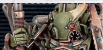

| APL | Move | Save | Wounds |
|-----|------|------|--------|
| 3   | 5"   | 3+   | 14     |

<table><tr><td>NAME</td><td>ATK</td><td>HIT</td><td>DMG</td><td>WR</td></tr><tr><td>Bolt pistol</td><td>4</td><td>3+</td><td>3/4</td><td>Range 8&quot;</td></tr><tr><td>Plague knife</td><td>5</td><td>3+</td><td>3/4</td><td>Severe, Poison*</td></tr></table>

Icon Bearer: Whenever determining control of a marker, treat this operative's APL stat as 1 higher. Note this isn't a change to its APL stat, so any changes are cumulative with this. 

Icon of Contagion: Whenever this operative is within your opponent's territory, the Contagion strategy ploy costs you OCP. 

PLAGUE MARINE®, CHAOS, HERETIC ASTARTES, ICON BEARER 

32 

## MALIGNANT PLAGUECASTER

| APL | Move | Save | Wounds |
|-----|------|------|--------|
| 3   | 5"   | 3+   | 14     |

<table><tr><td></td><td>NAME</td><td>ATK</td><td>HIT</td><td>DMG</td><td>WR</td></tr><tr><td></td><td>Entropy</td><td>4</td><td>3+</td><td>3/7</td><td>PSYCHIC, Range 7", Saturate, Severe, Poison*</td></tr><tr><td></td><td>Plague wind</td><td>6</td><td>3+</td><td>2/3</td><td>PSYCHIC, Saturate, Severe, Torrent 1", Poison*</td></tr><tr><td></td><td>Corrupted staff</td><td>4</td><td>3+</td><td>3/4</td><td>PSYCHIC, Severe, Shock, Stun, Poison*</td></tr></table>

RULES CONTINUE ON OTHER SIDE ▶ 

PLAGUE MARINE®, CHAOS, HERETIC ASTARTES, PSYKER, MALIGNANT PLAGUECASTER 

32 

## MALIGNANT PLAGUECASTER

| APL | Move | Save | Wounds |
|-----|------|------|--------|
| 3   | 5"   | 3+   | 14     |

## POISONOUS MIASMA

1AP 

## PUTRESCENT VITALITY

1AP 

PSYCHIC. Select one enemy operative visible to and within 7" of this operative, or one enemy operative that's a valid target for this operative. That enemy operative gains one of your Poison tokens (if it doesn't already have one). If it already has one, inflict 3 damage on that enemy operative instead. 

PSYCHIC. Select one friendly operative visible to and within 3" of this operative, then roll 2D6: if the result is 7, the selected operative regains 7 lost wounds; otherwise, the selected operative regains lost wounds equal to the highest D6. 

This operative cannot perform this action while within control range of an enemy operative. 

This operative cannot perform this action while within control range of an enemy operative, or more than once per turning point. 

## PLAGUE MARINE WARRIOR

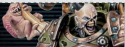

| APL | Move | Save | Wounds |
|-----|------|------|--------|
| 3   | 5"   | 3+   | 14     |

<table><tr><td>NAME</td><td>ATK</td><td>HIT</td><td>DMG</td><td>WR</td></tr><tr><td>Boltgun</td><td>4</td><td>3+</td><td>3/4</td><td>Toxic*</td></tr><tr><td>Plague knife</td><td>4</td><td>3+</td><td>3/4</td><td>Severe, Poison*</td></tr></table>

Repulsive Fortitude: Whenever an operative is shooting this operative, defence dice results of 5+ are critical successes. 

*Toxic: Whenever this operative is using this weapon against an enemy operative that has one of your Poison tokens, add 1 to both Dmg stats of this weapon. 

32 

## PLAGUE MARINES KILL TEAM

ARCHETYPE: SECURITY, SEEK & DESTROY 

## OPERATIVES

1 PLAGUE MARINE CHAMPION operative 

5 PLAGUE MARINE® operatives selected from the following list: 

BOMBARDIER 

FIGHTER 

HEAVY GUNNER 

ICON BEARER 

• MALIGNANT PLAGUECASTER 

WARRIOR 

Your kill team can only include each operative on this list once. 

Nurgle's number is 7 and his sigil shows 3. From these numbers does his corruption flow. 

## PLAGUE MARINE FACTION RULE

## ASTARTES

Space Marines are genetically augmented transhumans forged for only one purpose: war. 

During each friendly PLAGUE MARINE® operative's activation, it can perform either two Shoot actions or two Fight actions. If it's two Shoot actions, a bolt pistol, boltgun or PSYCHIC weapon must be selected for at least one of them. You cannot select the same PSYCHIC ranged weapon more than once per activation. 

Each friendly PLAGUE MARINE® operative can counteract regardless of its order. 

## PLAGUE MARINE FACTION RULE

## POISON

Nurgle deals in warp-tainted poisons, toxins, viral plagues and sicknesses of the soul that defy both natural resilience and medical intervention. 

Some weapons in this team's rules have the Poison weapon rule. 

*Poison: In the Resolve Attack Dice step, if you inflict damage with any successes, the operative this weapon is being used against (excluding friendly PLAGUE MARINE® operatives) gains one of your Poison tokens (if it doesn't already have one). Whenever an operative that has one of your Poison tokens is activated, inflict 1 damage on it. 

## PLAGUE MARINE FACTION RULE

## DISGUSTINGLY RESILIENT

The followers of Nurgle possess extreme resilience to bullet and blade, for their hideous forms are swollen by death, decay and disease. 

Whenever an attack dice inflicts damage of 3 or more on a friendly PLAGUE MARINE® operative, roll one D6: on a 4+, subtract 1 from that inflicted damage. 

## PLAGUE MARINE

## STRATEGY PLOY

## CONTAGION

Plague Marines are oozing with contagion, their hideous forms emanating a miasma of decay that saps the vigour of their foes. 

Subtract 2" from the Move stat of an enemy operative and worsen the Hit stat of its weapons by 1 (this isn't cumulative with being injured) whenever any of the following are true: 

- It has one of your Poison tokens and is visible to (or vice versa) and within 3" of friendly PLAGUE MARINE® operatives. 

- It's visible to (or vice versa) and within 3" of a friendly PLAGUE MARINE ICON BEARER operative. 

## PLAGUE MARINE

## STRATEGY PLOY

## LUMBERING DEATH

Plague Marines are methodical and uncompromising in their approach to warfare, advancing and firing with steadfast determination. 

Whenever a friendly PLAGUE MARINE® operative is shooting or fighting during an activation in which it hasn't moved more than 3", or whenever it's retaliating, its weapons have the Ceaseless weapon rule. 

## PLAGUE MARINE

## STRATEGY PLOY

## CLOUD OF FLIES

Disgusting, fat-bodied flies swarm the killzone, blurring the forms of advancing Plague Marines and absorbing the enemy's projectiles. 

Place one of your Cloud of Flies markers in the killzone. Whenever an operative is shooting a friendly PLAGUE MARINE® operative that's more than 3" from it, if that friendly operative is wholly within 1" of that marker, that friendly operative is obscured. In the Ready step of the next Strategy phase, remove that marker. 

## PLAGUE MARINE

## STRATEGY PLOY

## NURGLINGS

The smallest of Nurgle's daemons, Nurglings are both malicious and playful, cackling wildly as they claw and harass the Plague Marines' foes with pestilent claws and teeth. 

Select one enemy operative within 3" of a friendly PLAGUE MARINE® operative, or one enemy operative that has one of your Poison tokens and is within 7" of a friendly PLAGUE MARINE® operative. Until the end of the selected operative's next activation, subtract 1 from its APL stat. 

## PLAGUE MARINE

## FIREFIGHT PLOY

## PLAGUE MARINE

## FIREFIGHT PLOY

## VIRULENT POISON

The most potent of Grandfather Nurgle's foul plagues spread swiftly through the air, breaching even enviro-seals and filtration masks. 

Use this firefight ploy during a friendly PLAGUE MARINE® operative's activation or counteraction, before or after it performs an action. One enemy operative within 3" of, or visible to and within 7" of, that operative gains one of your Poison tokens (if it doesn't already have one). 

## POISONOUS DEMISE

The body of a Plague Marine plays host to countless poisons and plagues. Upon death, their bloated forms may detonate, spreading foul contagion all around. 

Use this firefight ploy when a friendly PLAGUE MARINE® operative is incapacitated, before it's removed from the killzone. Each enemy operative visible to and within 3" of that operative gains one of your Poison tokens (if they don't already have one); for each of those enemy operatives that already has one of your Poison tokens (including if they gained one during this action), inflict 1 damage on them instead. 

## PLAGUE MARINE

## FIREFIGHT PLOY

## PLAGUE MARINE

## FIREFIGHT PLOY

## SICKENING RESILIENCE

By voluntarily offering their bodies as hosts for the Grandfather's contagious gifts, some Plague Marines are granted even greater endurance. 

Use this firefight ploy when an attack dice inflicts damage on a friendly PLAGUE 

MARINE® operative. Until the end of the activation or counteraction, for the purposes of the Disgustingly Resilient rule for that operative, always subtract 1 from the damage inflicted (to a minimum of 2) – you don’t need to roll. 

## CURSE OF ROT

To engage a Plague Marine in single combat is to expose oneself to wilting contagion and soul-eroding decay. 

Use this firefight ploy when a friendly PLAGUE 

MARINE® operative is shooting against or fighting against an enemy operative within 3" of it (or within 7" of it if that enemy operative has one of your Poison tokens), after your opponent rolls their attack or defence dice. For each result of 3 they roll, inflict 1 damage on that enemy operative, that result cannot be retained as a success and they cannot re-roll it. 

## PLAGUE MARINE! FACTION EQUIPMENT

## PLAGUE BELLS

When the plague bells toll, the Death Guard are infused with corrupted energy, heightening their unholy resilience to extraordinary levels. 

You can ignore any changes to the stats of friendly PLAGUE MARINE® operatives from being injured (including their weapons' stats). 

## PLAGUE MARINEO FACTION EQUIPMENT

## BLIGHT GRENADES

These devices are packed with explosives, shards of jagged metal and deadly pathogens that poison any unfortunate enough to survive the initial blast. 

Friendly PLAGUE MARINE operators have the following ranged weapon (you cannot select it for use more than twice during the battle): 

<table><tr><td>NAME</td><td>ATK</td><td>HIT</td><td>DMG</td></tr><tr><td>Blight grenade</td><td>4</td><td>4+</td><td>2/4</td></tr><tr><td>WR</td><td></td><td></td><td></td></tr></table>

Range 6", Blast 2", Saturate, Severe, Poison* 

## PLAGUE MARINE FACTION EQUIPMENT

## PLAGUE ROUNDS

Virulent toxins ooze from these projectiles, so that those struck by them are infected with deadly diseases. 

Friendly PLAGUE MARINE® operatives' boltguns and bolt pistols have the Poison and Severe weapon rules. 

## PLAGUE MARINE FACTION EQUIPMENT

## POISON VENTS

Activating vents in their power armour, Plague Marines may unleash clouds of sickening fumes that clog the lungs of nearby foes. 

Whenever an enemy operative is activated within 3" of a friendly PLAGUE MARINE operative: 

- If that enemy operative doesn't have one of your Poison tokens, roll one D3: on a 3, it gains one. 

- If that enemy operative has one of your Poison tokens, inflict D3 damage on it (instead of 1). 

Rules will be periodically updated to maintain fair balance and interact more smoothly with the game. Rules changes will be updated directly into online documents and then listed below. Any minor changes to standardise wording that don't have any practical impact on the rule will be updated directly into online documents but not be listed here. 

## ERRATA

APRIL '26 

This section collects amendments to the rules. Amended text for clarification and edits are shown in blue, while amended text for balance updates are shown in magenta. 

HEAVY GUNNER & FIGHTER OPERATIVES, WEAPONS LIST 

'Bolt pistol' weapon added. 

## CHAMPION OPERATIVE, GRANDFATHER'S BLESSING RULE

Changed to read: 

'Whenever an enemy operative that has one of your Poison tokens loses one or more wounds within 7" of this operative, this operative regains up to an equal number of lost wounds (to a maximum of 3 lost wounds per turning point, and only if this operative isn't incapacitated).' 

## MALIGNANT PLAGUECASTER OPERATIVE, PUTRESCENT VITALITY ACTION

Condition changed to read: 

'This operative cannot perform this action while within control range of an enemy operative, or more than once per turning point.' 

## FIGHTER OPERATIVE, FLAIL ACTION

Second sentence of effect changed to read: 

‘Roll separately for each: if it’s an enemy operative, if the D3 result is a 3, that enemy operative also gains one of your Poison tokens (if it doesn’t already have one).’ 

## ICON BEARER OPERATIVE, ICON OF CONTAGION

Changed to read: 

'Whenever this operative is within your opponent's territory, the Contagion strategy ploy costs you OCP.' 

## FACTION RULES, ASTARTES

Third sentence of first paragraph changed to read: 

'You cannot select the same PSYCHIC ranged weapon more than once per activation.' 

## FACTION RULES, POISON

Relevant part of first sentence of weapon rule changed to read: 

‘[...] the operative this weapon is being used against (excluding friendly PLAGUE MARINE cooperatives) gains one of your Poison tokens [...]’ 

## FACTION EQUIPMENT, POISON VENTS

Changed to read: 

'Whenever an enemy operative is activated within 3" of a friendly PLAGUE MARINE operative: 

- If that enemy operative doesn't have one of your Poison tokens, roll one D3: on a 3, it gains one. 

- If that enemy operative has one of your Poison tokens, inflict D3 damage on it (instead of 1). 

## FIREFIGHT PLOYS, POISONOUS DEMISE

Additional text added to end of first sentence: 

'Use this firefight ploy when a friendly PLAGUE 

MARINE® operative is incapacitated, before it's removed from the killzone.' 

## FIREFIGHT PLOYS, CURSE OF ROT

Second sentence changed to read: 

'For each result of 3 they roll, inflict 1 damage on that enemy operative, that result cannot be retained as a success and they cannot re-roll it.' 

## FIREFIGHT PLOYS, VIRULENT POISON

Changed to read: 

'Use this firefight ploy during a friendly PLAGUE MARINE operative's activation or counteraction, before or after it performs an action. Select one of the following: 

One enemy operative within 3" of, or visible to and within 7" of, that operative gains one of your Poison tokens (if it doesn't already have one). 

- Roll 2D6: if the result is $7+$ , one enemy operative within $7''$ of that operative gains one of your Poison tokens (if it doesn't already have one). 

## STRATEGY PLOYS, CLOUD OF FLIES

Relevant part of second sentence changed to read: '[...] if that friendly operative is wholly within 1" of that marker, that friendly operative is obscured.' 

## STRATEGY PLOYS, CONTAGION

First bullet point deleted: 

‘It’s within control range of friendly PLAGUE 

MARINE-operatives. 

## PREVIOUS ERRATAS

## CHAMPION OPERATIVE, GRANDFATHER’S BLESSING RULE

Changed to read: 

‘Whenever an enemy operative that has one of your Poison tokens loses one or more wounds within 7" of this operative, this operative regains up to an equal number of lost wounds (to a maximum of 3 lost wounds per turning point, and only if this operative isn’t incapacitated).’ 

## MALIGNANT PLAGUECASTER OPERATIVE, PUTRESCENT VITALITY ACTION

Condition changed to read: 

‘This operative cannot perform this action while within control range of an enemy operative, or more than once per turning point.’ 

## FIGHTER OPERATIVE, FLAIL ACTION

Second sentence of effect changed to read: 

‘Roll separately for each: if it’s an enemy operative, if the D3 result is a 3, that enemy operative also gains one of your Poison tokens (if it doesn’t already have one).’ 

## ICON BEARER OPERATIVE, ICON OF CONTAGION

Changed to read: 

‘Whenever this operative is within your opponent’s territory, the Contagion strategy ploy costs you OCP.’ 

## FACTION RULES, ASTARTES

Third sentence of first paragraph changed to read: 

‘You cannot select the same PSYCHIC ranged weapon more than once per activation.’ 

## FACTION RULES, POISON

Relevant part of first sentence of weapon rule changed to read: 

‘[...] the operative this weapon is being used against (excluding friendly PLAGUE MARINE® operatives) gains one of your Poison tokens [...]’ 

## FACTION EQUIPMENT, POISON VENTS

Changed to read: 

‘Whenever an enemy operative is activated within 3" of a friendly PLAGUE MARINE operative: 

- If that enemy operative doesn’t have one of your Poison tokens, roll one D3: on a 3, it gains one. 

- If that enemy operative has one of your Poison tokens, inflict D3 damage on it (instead of 1).’ 

## FIREFIGHT PLOYS, POISONOUS DEMISE

Additional text added to end of first sentence: 

‘Use this firefight ploy when a friendly PLAGUE MARINE® operative is incapacitated, before it’s removed from the killzone.’ 

## FIREFIGHT PLOYS, CURSE OF ROT

Second sentence changed to read: 

‘For each result of 3 they roll, inflict 1 damage on that enemy operative, that result cannot be retained as a success and they cannot re-roll it.’ 

## FIREFIGHT PLOYS, VIRULENT POISON

Changed to read: 

‘Use this firefight ploy during a friendly PLAGUE MARINE operative’s activation or counteraction, before or after it performs an action. Select one of the following: 

- One enemy operative within 3" of, or visible to and within 7" of, that operative gains one of your Poison tokens (if it doesn’t already have one). 

- Roll 2D6: if the result is 7+, one enemy operative within 7" of that operative gains one of your Poison tokens (if it doesn’t already have one).’ 

## STRATEGY PLOYS, CLOUD OF FLIES

Relevant part of second sentence changed to read: 

‘[...] if that friendly operative is wholly within 1" of that marker, that friendly operative is obscured.’ 

## STRATEGY PLOYS, CONTAGION

First bullet point deleted: 

‘It’s within control range of friendly PLAGUE MARINE® operatives.’ 

## PLAGUE MARINE OPERATIVES

Corrupted sons of Mortarion, Plague Marines are suffused and bloated with rot and disease. Though compact and slow moving, Plague Marines are horrifyingly resilient, trudging relentlessly towards their objectives while spreading contagion in their wake. 

## PLAGUE MARINE CHAMPION

Armed with centuries of experience and warp-tainted weaponry, Champions are the rotten core of Plague Marine warbands. They lead from the front, setting a gory example for their troops to follow. 

## PLAGUE MARINE BOMBARDIER

The Death Guard have long been terrifying trench fighters. Bombardiers specialise in breaking dug-in positions with hails of explosives, from armour-sundering krak grenades to hypertoxic blight grenades. 

## PLAGUE MARINE FIGHTER

Many Plague Marines prefer to fight their foes up close. They wade through the enemy ranks, with every swing of their plague-blessed weapons spreading new infections. 

## PLAGUE MARINE HEAVY GUNNER

The arsenals of the Death Guard are filled with deadly weaponry, from lethal arcana to forbidden chem-agents from bygone ages. Heavy Gunners wield these tools of war to horrific effect. 

## PLAGUE MARINE ICON BEARER

Icon Bearers are honoured to bear the cursed standards of the Death Guard. Each is a locus for decay that saps the will of nearby foes and enhances the vigour of their fellow Plague Marines. 

## MALIGNANT PLAGUECASTER

Malignant Plaguecasters channel the foetid energies of Nurgle's realm. The foul cycle of decay and rebirth is theirs to master, whether unleashing clouds of killing wind or revitalising their brethren. 

## PLAGUE MARINE WARRIOR

Almost nothing can stop a Plague Marine on the march. Shielded by power armour and Nurgle's vile blessings, these warriors march through storms of enemy fire in pursuit of their objective. 

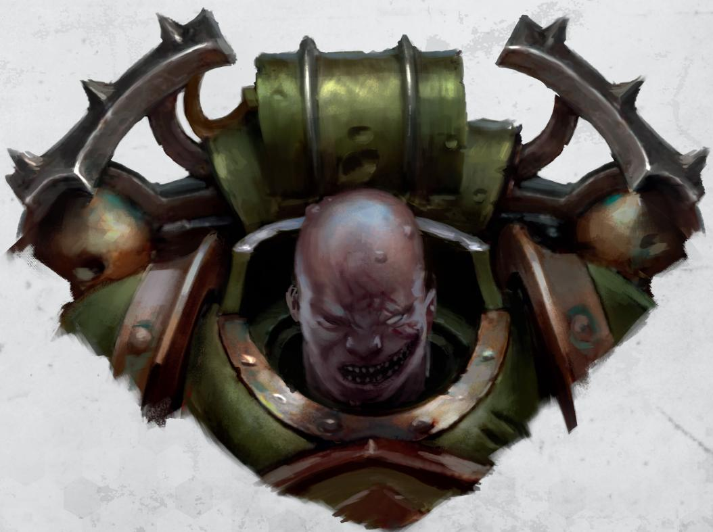

## PLAGUE MARINES KILL TEAM

Below you will find a list of the operatives that make up a PLAGUE MARINE kill team, including, where relevant, any weapons specified for that operative. 

## OPERATIVES

1 PLAGUE MARINE CHAMPION operative 

5 PLAGUE MARINE® operatives selected from the following list: 

BOMBARDIER 

FIGHTER 

HEAVY GUNNER 

- ICON BEARER 

• MALIGNANT PLAGUECASTER 

WARRIOR 

Your kill team can only include each operative on this list once. 

Nurgle's number is 7 and his sigil shows 3. From these numbers does his corruption flow. 

## ARCHETYPES

SECURITY

SEEK & DESTROY

Archetypes are used in certain mission packs, e.g. Approved Ops. The game sequence will specify how. 

CHAMPION

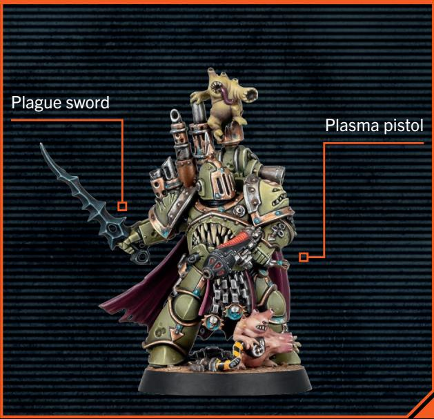

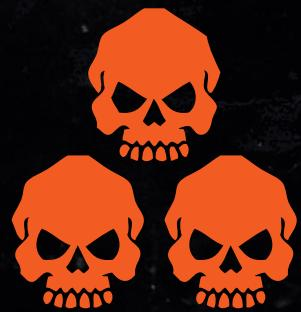

BOMBARDIER

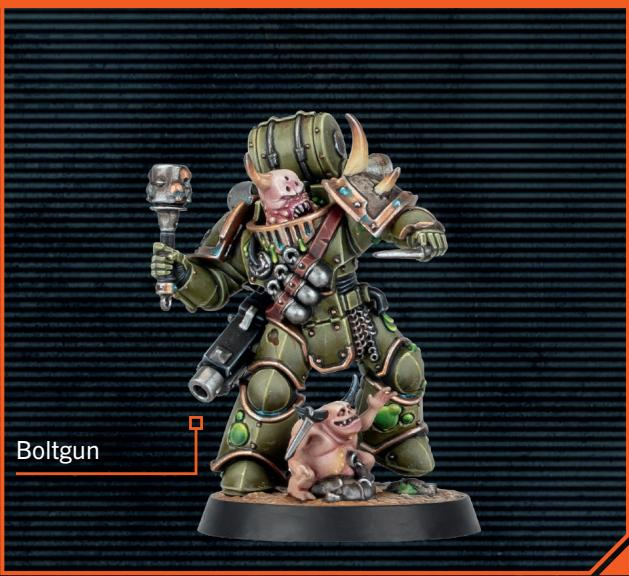

ICON BEARER

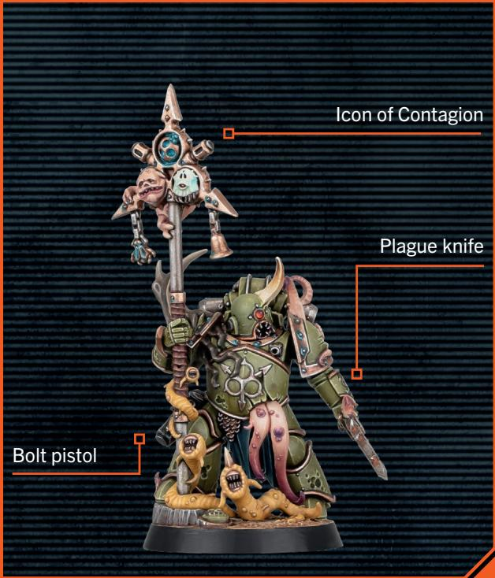

FIGHTER

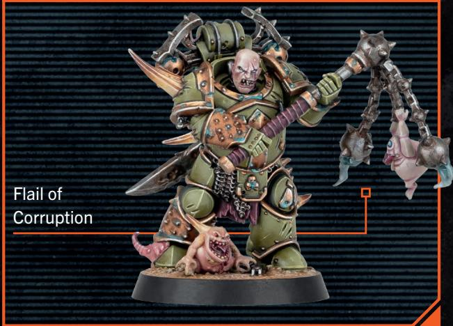

MALGINANT PLAGUECASTER

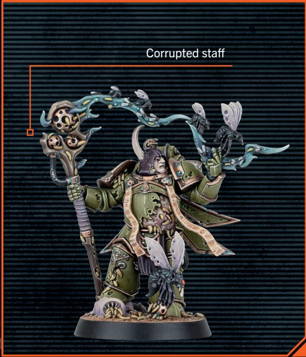

HEAVY GUNNER

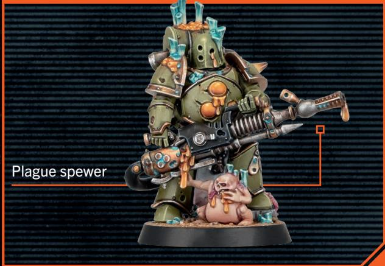

WARRIOR

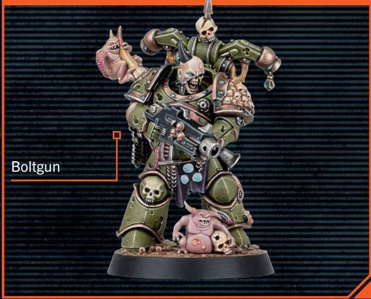
