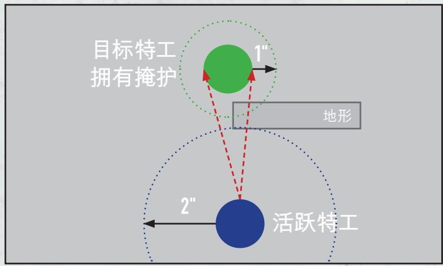
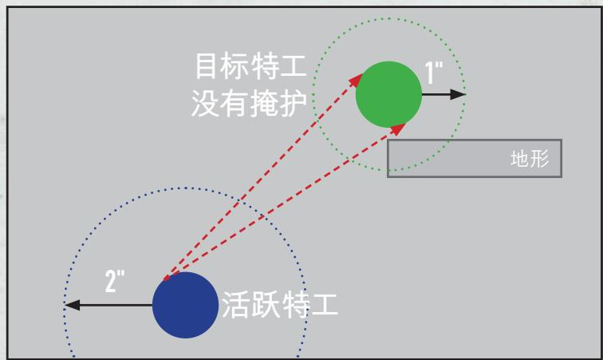

## 简化规则

《杀戮小队》是一款发生在第41千年黑暗未来中的微缩模型战术对决游戏。两支由精英特工组成的敌对小队将进行战斗并通过完成目标来取得胜利。本处展示的规则是《杀戮小队》核心规则书中内容的简化版本。它们被设计用于进行快速简单的入门游戏。在通常情况下，一局游戏将使用任务手册中的任务，但是您在学习游戏的基础机制期间可以不使用任务进行游戏。一些术语将使用橙色进行标记，它们将在简化规则的对应章节中进行更详细的解释。杀戮小队的规则可以在warhammer-community.com网站或者战锤40000杀戮小队：应用程序中免费进行查看。

## 部署

每一名玩家将选择一支杀戮小队并使用它们对应的 Citadel 微缩模型（特工），以及杀戮小队的免费规则、一个由 30" x 22" 游戏桌板（除非有其他明确规定）和地形模型组成的杀戮区、英寸测量工具、10 个六面骰（D6），以及指示物和标识。

布置杀戮区，随后随机决定一名玩家来获得先手权。拥有先手权的玩家选择一个任务地图上的杀戮区。如果您没有使用任务，那么拥有先手权的玩家选择一个杀戮区边缘来作为自己的边缘；另一侧的边缘是对手玩家的杀戮区边缘。玩家的降落区是位于自己杀戮区边缘3"内的区域。

从拥有先手权的玩家开始，玩家轮流部署自己杀戮小队的三分之一（向上取整）。在部署特工时，特工必须完全位于己方降落区内，并且拥有隐匿命令（将对应的指示物放在特工的一旁）。

## 交战命令

一名拥有交战命令的特工可以照常执行行动和反应。

## 隐匿命令

一名拥有隐匿命令的特工在拥有掩护时不能成为有效目标，并且不能执行射击或冲锋行动。

就绪

待机

就绪

待机

## 开始战斗

一场战斗包含四个转折点（除非有其他明确规定）。每一个转折点包含一个战略阶段和一个交战阶段。

## 战略阶段

双方玩家各掷一枚 D6：掷骰结果最高的玩家决定哪一方拥有先手权；如果结果持平，那么当前没有先手权的玩家决定先手权。玩家在战斗开始时拥有 2CP，可以消耗它们使用计谋。在第一战略阶段中，玩家各获得 1CP。在第一战略阶段之后的每一个战略阶段中，拥有先手权的玩家获得 1CP，没有先手权的玩家获得 2CP。每一个计划消耗 1CP。

双方玩家将所有的己方特工就绪（将命令指示物翻到就绪一面）。从拥有先手权的玩家开始，玩家轮流选择使用一个战略计划或者跳过，直到双方玩家连续选择跳过为止。每一个战略计谋也属于一个战略计划。双方玩家在同一个转折点中不能使用同一个战略计划超过一次。

## 交战阶段

从拥有先手权的玩家开始，玩家轮流激活就绪的己方特工。每当一名特工被激活时，先选择其拥有的命令（交战或隐匿）。随后，那名特工执行行动，并且在执行行动期间被称为活跃特工。每一个行动都会消耗AP，并且您消耗的AP数量不能超过特工的APL属性。除非有其他明确规定，否则一名特工不能在同一次激活中执行同一个行动超过一次。在特工完成执行行动后，特工进入待机（将特工的命令指示物翻面）。在所有特工都进入待机后，转折点结束。

玩家可以在这个阶段中消耗 CP 来使用交战计谋，这也包括指挥重掷交战计谋（见下方）。每一个计谋消耗 1CP，并且除了指挥重掷以外，双方玩家在同一个转折点中不能使用同一个交战计谋超过一次。

## 指挥重掷

在您掷攻击骰或防御骰之后使用此交战计谋。您可以重掷一枚骰子。

## 特工是否都被激活？

## 反应

在您可以激活一名就绪的己方特工时，如果您的所有特工都进入待机，并且对手依旧拥有就绪的特工，那么您可以选择一名进入待机且拥有交战命令的己方特工来无消耗执行一个消耗1AP的行动。每一名特工在每个转折点中只能进行1次反应，并且在进行反应时不能移动超过2"。

## 行动

## 转移

1AP 

将一名特工移动至其能够容纳的位置，移动的最大距离相当于其移动属性。特工不能移动进入敌方特工的控制范围内。

特工不能在敌方特工的控制范围内执行此行动，也不能在执行了后撤或者冲锋行动的激活期间执行此行动。

## 冲刺

1AP 

与转移行动效果相同，但是特工不能移动超过3"，并且不能攀爬。

特工不能在敌方特工的控制范围内执行此行动，也不能在执行了冲锋行动的激活期间执行此行动。

## 后撤

2AP 

与转移行动效果相同，但特工可以移动进入敌方特工的控制范围，但是不能在那里结束移动。

除非该特工位于敌方特工的控制范围内，否则该特工不能执行此行动。特工不能在执行了转移或者冲锋行动的激活期间执行此行动。

## 冲锋

1AP 

与转移行动效果相同，但是活跃特工能够移动额外2"。特工可以移动进入敌方特工的控制范围，并且必须在敌方特工的控制范围内结束这次移动。如果特工移动进入了一个敌方特工的控制范围，并且那个敌方特工的控制范围内不存在任何己方特工，那么该特工不能移动离开那个敌方特工的控制范围。

如果特工拥有隐匿命令，并且已经位于敌方特工的控制范围内，或者在同一次激活期间执行了转移、冲刺或者后撤行动，那么特工不能执行此行动。

## 射击

1AP 

使用活跃特工进行射击，具体请参见下一页。

◆ 特工不能在拥有隐匿命令或者位于敌方特工的控制范围内时执行此行动。

## 近战

1AP 

使用活跃特工进行近战，具体请参见下一页。

除非敌方特工位于该特工的控制范围内，否则特工不能执行此行动。

## 射击

正在执行这个行动的玩家是攻击方。控制攻击目标的玩家是防御方。在掷攻击/防御骰时，每个结果为6的掷骰属于关键成功。任何其他类型的成功属于普通成功。每个结果为1的掷骰总是失败。

1. 攻击方为进行射击的特工选择一件远程武器。

2. 攻击方选择一个对活跃特工而言属于有效目标，并且控制范围内不存在己方特工的敌方特工。

3. 攻击方掷出相当于武器攻击属性数量的 D6，这些骰子被称为攻击骰。每一个结果大于等于武器命中属性的攻击骰将被作为成功进行保留。每一个没有满足条件的攻击骰将作为失败被舍弃。

4. 防御方掷出三枚 D6，这被称为防御骰。每一个结果大于等于目标豁免属性的防御骰将作为成功进行保留。每一个不满足条件的防御骰将被作为失败并被舍弃。如果目标拥有掩护，那么防御方可以在不进行掷骰的情况下将一枚防御骰作为普通成功进行保留。

5. 防御方分配所有成功的防御骰来抵挡成功的攻击骰。

- 一次普通成功可以抵挡一次普通成功。

- 两次普通成功可以抵挡一次关键成功。

- 一次关键成功可以抵挡一次普通成功或者关键成功。

6. 所有没有被抵挡且成功的攻击骰将对目标特工造成伤害。

- 一次普通成功将造成相当于武器普通伤害属性数量的伤害（武器伤害属性的第一个数值）。

- 一次关键成功将造成相当于武器暴击伤害属性数量的伤害（武器伤害属性的第二个数值）。

## 近战

正在执行这个行动的玩家是攻击方。控制攻击目标的玩家是防御方。在掷攻击时，每个结果为6的掷骰属于关键成功。任何其他类型的成功属于普通成功。每个结果为1的掷骰总是失败。

1. 攻击方选择一个位于活跃特工控制范围内的敌方特工来作为近战对象，那名敌方特工将进行反击。

2. 双方玩家为自己的特工选择一件近战武器。

3. 双方玩家掷出相当于他们各自使用的武器攻击属性数量的 D6，这些骰子被称为攻击骰。每一个结果大于等于武器命中属性的攻击骰将被作为成功进行保留。每一个没有满足条件的攻击骰将作为失败被舍弃。

4. 从攻击方开始，双方玩家轮流结算自己未被格挡的成功攻击骰（如果对方没有任何剩余的成功，那么结算所有剩余的成功攻击骰）。在结算一枚攻击骰时，玩家必须选择进行出击或者格挡。

- 出击：对敌方特工造成伤害。一次普通成功将造成相当于武器普通伤害属性数量的伤害（武器伤害属性的第一个数值）。一次关键成功将造成相当于武器暴击伤害属性数量的伤害（武器伤害属性的第二个数值）。

- 格挡：将这枚骰子用来格挡对手一次未被结算的成功。一次普通成功可以格挡一次普通成功。一次关键成功可以格挡一次常规成功或关键成功。

## 伤害

每一个特工都拥有一个耐伤属性，这代表着它们可以承受的伤害数量。在对特工造成伤害时，特工的耐伤将减少对应的数量。

在一名特工拥有的耐伤数量低于起始耐伤数量时，该特工受伤。如果一名特工拥有的耐伤数量低于起始耐伤的一半，那么该特工受创。在一名特工受创时，其移动属性减少2"，武器的命中属性降低1。耐伤为0或更低的特工被残废，将其移出游戏。

## 控制范围

特工的控制范围指的是位于其 1" 内且可见的区域。特工之间的控制范围是相互的，意味着就算只有一名特工满足上述的条件，两名特工也都位于彼此的控制范围内。

## 有效目标

一些规则，例如射击，会需要您判断一名特工的有效目标。

如果预定目标拥有交战命令并对特工可见，那么这个目标便是有效目标。

如果预定目标拥有隐匿命令，对特工可见，并且没有掩护，那么该目标是有效目标。

## 可见

如果某个物体对特工可见，这意味着特工必须能够物理性地看见它（站在特工的身后并进行观察，判断您是否可以从特工的头部画出一条直线并无阻碍地到达目标除了底座以外的任何一个部分上）。

## 掩护

掩护是根据两个特工之间的特定情况来决定的。如果一名特工的控制范围内存在一个阻碍的地形，那么该特工拥有掩护。不过，如果另一名特工位于上述特工的2"内，那么该特工不能拥有掩护。

## 武器规则

精准 x：您可以在不掷骰子的情况下将最多 x 枚攻击骰作为普通成功进行保留。

平衡：您可以重掷一枚攻击骰。

爆炸 x：您选择的目标被称为主要目标。对主要目标进行射击后，使用该武器对每一个次要目标进行射击，顺序由您决定（为每一个目标单独掷骰）。次要目标是任何位于主要目标 x 距离内且对其可见的其他特工，例如“爆炸 2”（所有范围内的特工都属于有效目标，隐匿命令在此处没有作用）。如果主要目标拥有掩护且被遮挡，那么次要目标也是如此。

残暴：您的对手只能使用关键成功进行抵挡。

无休：您可以选择一个掷骰结果并重掷那些攻击骰(例如重掷所有结果为2的攻击骰)。

毁灭 x：您每次在保留一次关键成功时可以立即对成为本武器目标的特工造成 X 点伤害，例如毁灭 3。如果规则的前方存在一个距离（例如 “1” 毁灭 x”），那么对成为目标的特工以及位于其指定距离内且可见的其他特工造成 x 点伤害。请注意，被保留的成功没有被该规则舍弃——那次成功依旧需要在之后进行结算。

重型：一名特工不能在进行过移动的激活或反应期间使用这件武器，并且不能在使用过本武器的激活或反应中进行移动。如果本武器规则是“重型(仅限 x)”，这里的 x 指的是一种移动行动，并且特工只能被允许执行那种移动行动，例如“重型(仅限冲刺)”。这类武器不会影响戒备行动的进行。

过热：在一名特工使用本武器后，掷一枚 D6。如果结果小于武器的命中属性，那么对特工造成相当于掷骰结果乘以二数量的伤害。如果本武器在一次行动中被多次使用（例如“爆炸”和“洪流”），您只需要掷一枚 D6。

致命 x+：结果大于等于 x 的成功属于关键成功，例如 “致命 5+”。

有限 x：当一名特工在战斗中使用本武器 x 次后，特工不再拥有本武器。如果本武器在一次行动中被多次使用(例如“爆炸”)，将它视作为被使用了一次。

穿刺 x：防御方掷出的防御骰数量减少 X 枚，例如 “穿刺 1”。如果规则为 “关键穿刺 x”，那么这个规则只有在您保留了任何关键成功时才会生效。

重击：如果您保留了任何关键成功，那么您可以将一次失败作为成功的普通成功进行保留，而不是将其舍弃。

范围 x：只有在活跃特工 x 范围内的特工才能成为有效目标，例如 “范围 9”。

毫不留情：您可以重掷任何攻击骰。

撕裂：如果您保留了任何关键成功，那么您可以将一次普通成功作为关键成功进行保留。

集中：防御者不能获得掩护豁免（必须进行掷骰）。

追踪：在选择有效目标时，特工不能使用地形获得掩护。如果规则是“追踪轻型”，那么特工不能使用轻型掩体获得掩护。虽然这个武器规则会让上述的特工成为有效目标(如果他们可见)，但是这不会移除特工的掩护豁免(若有)。

严重：如果您没有保留任何关键成功，那么您可以将一次普通成功替换成关键成功。任何在保留关键成功时触发的规则也会被触发（例如“毁灭”、“关键穿刺”，等）。

震荡：在您首次使用关键成功出击时，将对手还未结算的一次普通成功舍弃(如果没有普通成功，则舍弃一次关键成功)。

安静：特工可以在拥有隐匿命令时使用本武器执行射击行动。

晕眩：如果您保留了任何关键成功，那么被本武器攻击的特工的APL属性减少1点，直到目标的下一次激活结束为止。

洪流 x: 照常选择有效目标来作为首要目标，随后选择位于首要目标 x 距离内，但不位于己方特工控制范围内的任意数量的其他有效目标来作为次要目标，例如 洪流 2"。使用武器对所有目标进行射击，结算流程由您来决定(为每个目标分别进行掷骰)。